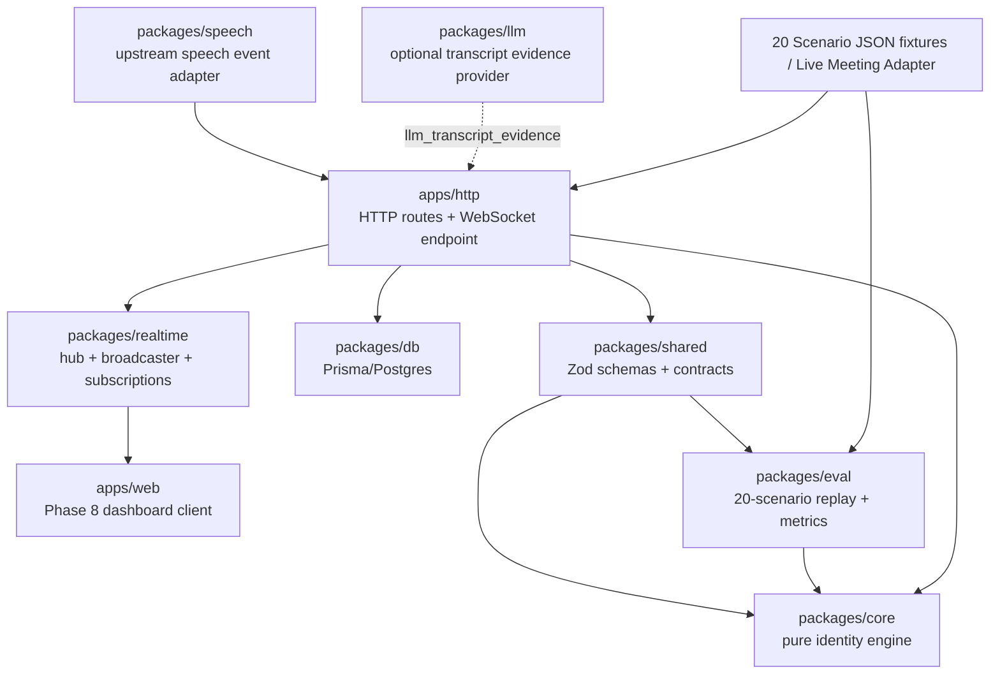
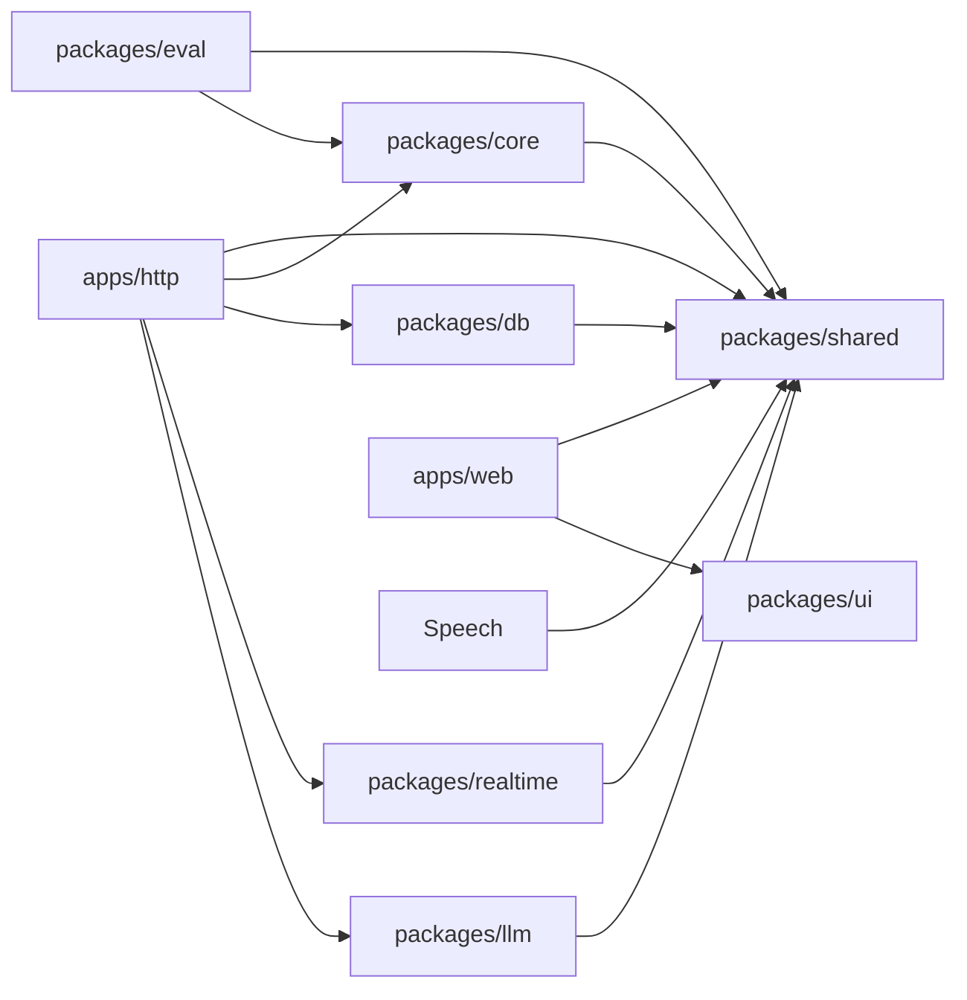

# Architecture

Sherlock's Candidate Identity Fusion Engine is designed as a monorepo with pure domain logic in the center and thin delivery layers around it.

## Package Responsibilities

| Area | Current status | Target responsibility |
| --- | --- | --- |
| `apps/web` | Present with Phase 8 dashboard | Real-time interview dashboard for scenario replay, participant grid, candidate decision, evidence, uncertainty, criteria transparency, transcript, and timeline. |
| `apps/docs` | Removed | Not part of the current target architecture. |
| `apps/http` | Present with Fastify routes and WebSocket endpoint | Deployable backend transport/composition layer. It composes HTTP routes and the WebSocket endpoint in one server, validates inputs, calls packages, persists snapshots when configured, and broadcasts candidate-state updates. |
| `packages/core` | Present with fusion engine | Pure identity engine: session state, deterministic signals, weighted fusion scoring, confidence/state decisions, ambiguity handling, and explanations. |
| `packages/shared` | Present | Zod schemas and TypeScript contracts for meetings, participants, events, evidence, candidate state, WebSocket messages, and scenario files. |
| `packages/db` | Present | Prisma schema, migrations, typed client helper, and repository functions for meetings, participants, events, score snapshots, and scenario results. |
| `packages/llm` | Present with Gemini provider and mock provider | Provider interface and adapters that convert transcript chunks into structured role evidence. It must not make final candidate decisions. |
| `packages/realtime` | Present with registry and broadcaster helpers | Reusable realtime infrastructure only: connection registry, broadcaster, meeting subscriptions, typed broadcast helpers. It is not a deployable server. |
| `packages/eval` | Present with scenario harness | Scenario replay, expected-vs-actual checks, evaluation metrics, and CLI reporting. |
| `packages/speech` | Present with collector scaffolding | Converts structured upstream speech activity and transcript observations into shared meeting events. It does not record raw audio or compute candidate identity. |
| `packages/ui` | Present as shared React/Tailwind components | Shared visual components used by web surfaces, if helpful. |
| `packages/eslint-config` | Present | Shared lint configuration. |
| `packages/typescript-config` | Present | Shared TypeScript configuration. |
| `packages/tailwind-config` | Present | Shared Tailwind styles/configuration. |
| `scenarios` | Present with 20 fixtures | JSON meeting simulations and expected outcomes for repeatable evaluation and dashboard replay. |

## Dependency Boundaries

Allowed dependency direction:

- `apps/http` may depend on `packages/shared`, `packages/core`, `packages/db`, `packages/realtime`, `packages/eval` for replay endpoints if needed, and `packages/llm` only as an evidence source.
- `apps/web` may depend on `packages/shared` and `packages/ui`.
- `packages/eval` may depend on `packages/shared` and `packages/core`.
- `packages/speech` may depend on `packages/shared` only.
- `packages/llm` may depend on `packages/shared` for transcript evidence schemas.
- `packages/db` may depend on `packages/shared` for persisted contract types.
- `packages/realtime` may depend on `packages/shared` for typed broadcast messages.
- `packages/core` may depend on `packages/shared`, but must not depend on apps, DB, realtime, UI, or LLM providers.

Bun-first package export rule:

- Internal packages export direct TypeScript entrypoints such as `./index.ts`.
- Submodules export direct `.ts` files such as `./broadcaster.ts` or `./metrics.ts`.
- Runtime exports must not point to `dist/*.js`.
- New packages should follow the existing root-level module convention unless there is a strong reason to add `src/`.

Forbidden dependency direction:

- Packages must not depend on apps.
- `packages/core` must not import Fastify, Prisma, WebSocket libraries, React, OpenAI/Gemini SDKs, server-specific APIs, filesystem state, network calls, or environment variables.
- `packages/realtime` must not become a separate deployable backend.
- `packages/llm` must not select the candidate directly.
- `packages/db` must persist shared-shaped records and snapshots, not compute candidate identity.
- `packages/speech` must not import core, DB, Fastify, React, realtime, audio/CV libraries, or LLM providers. It maps structured metadata into events only.

## Event Flow

1. Meeting metadata and participant events arrive from a scenario replay or future live meeting adapter.
2. Future meeting-platform, bot, or ASR sources may pass structured speech observations through `packages/speech`, which emits `speaking_activity` and `transcript_chunk` events without recording raw audio.
3. `apps/http` validates and normalizes the payload using `packages/shared` schemas.
4. For `transcript_chunk` events, `apps/http` may optionally call `packages/llm` to create a structured `llm_transcript_evidence` event.
5. `apps/http` applies events to the current meeting session and calls `packages/core`.
6. `packages/core` extracts deterministic evidence signals, fuses them into confidence-ranked participants, handles ambiguity, and returns explanations/uncertainty.
7. `apps/http` persists events and score snapshots through `packages/db`.
8. `apps/http` uses `packages/realtime` to broadcast a `candidate_state_updated` message over its WebSocket endpoint.
9. `apps/web` renders the selected candidate, confidence timeline, participant leaderboard, evidence, uncertainty, transcript, criteria charts, and raw event timeline.
10. `packages/eval` replays the same 20 scenario fixtures directly through `packages/core` to measure accuracy and edge-case behavior without API/UI dependencies.

LLM transcript evidence flow:

```text
transcript_chunk event
        ↓
optional packages/llm classifier
        ↓
llm_transcript_evidence event
        ↓
apps/http session store
        ↓
packages/core fusion
        ↓
candidate_state_updated WebSocket
        ↓
apps/web dashboard
```

Speech metadata flow:

```text
Meeting Platform / Bot / ASR
        ↓
Speech Metadata Collector
        ↓
speaking_activity / transcript_chunk events
        ↓
apps/http ingestion endpoint
        ↓
packages/core
        ↓
CandidateStateSnapshot
```

## Mermaid Diagram



## Dependency Graph



## Why `apps/http` Stays Thin

`apps/http` is a transport and composition layer. It should own deployment concerns, server startup, HTTP routing, WebSocket endpoint registration, request validation, package orchestration, and error mapping.

It should not own candidate scoring, signal extraction, confidence thresholds, state transitions, explanation generation, scenario metrics, or transcript classification logic. Those responsibilities belong to packages so the behavior can be tested without booting the backend server.

## Why `packages/core` Stays Pure

`packages/core` is the engineering center of the project. It decides which participant is likely to be the candidate, when evidence is insufficient, and when two participants are too close to choose safely.

Keeping it pure means it accepts plain TypeScript objects and returns plain TypeScript objects. It should not know how events arrived, where snapshots are stored, how dashboards render, which WebSocket client is connected, or which LLM provider is available. That separation gives the project four advantages:

- Fast unit tests for the scoring, confidence, ambiguity, and explanation behavior.
- Repeatable scenario evaluation without starting Postgres, Fastify, WebSocket clients, or React.
- Safer future integrations because API, DB, dashboard, and LLM failures cannot leak into the decision logic.
- Clear auditability: the final candidate decision comes from deterministic evidence fusion, while LLM output is only one structured evidence source.
