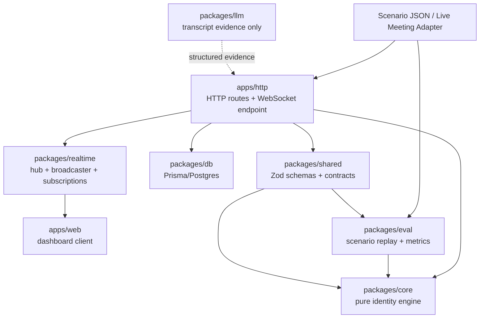
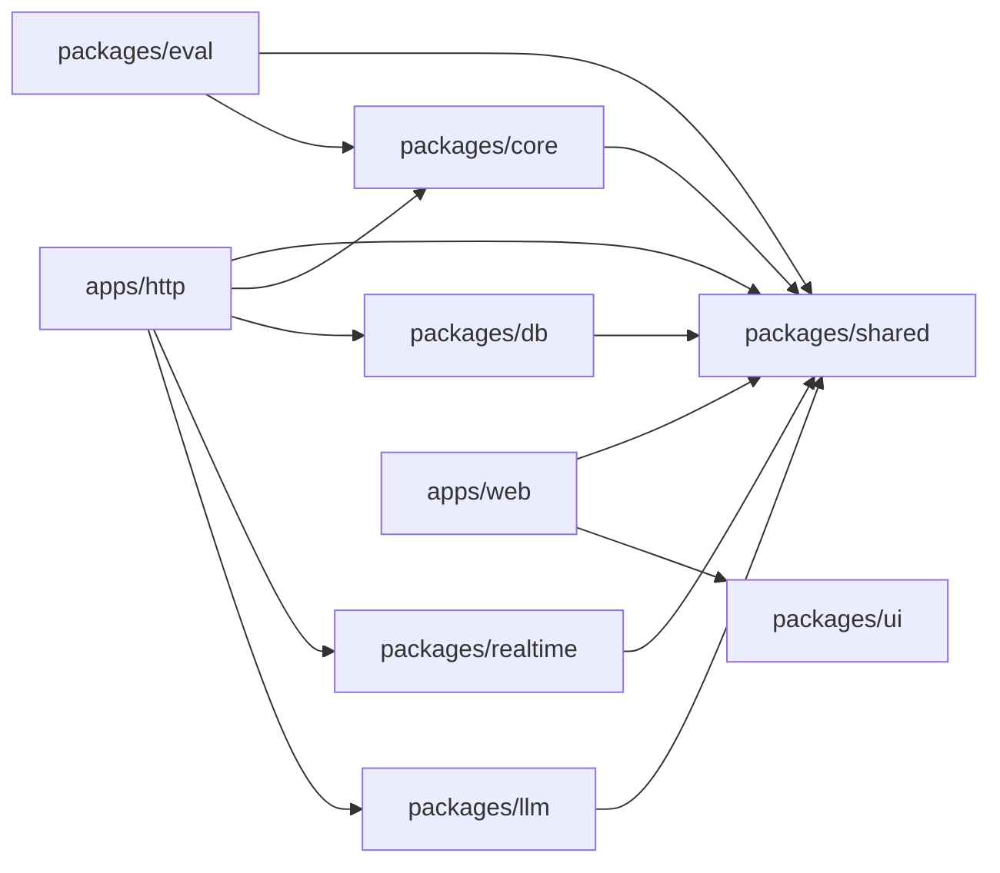

# Architecture

Sherlock's Candidate Identity Fusion Engine is designed as a monorepo with pure domain logic in the center and thin delivery layers around it.

## Package Responsibilities

| Area | Current status | Target responsibility |
| --- | --- | --- |
| `apps/web` | Present as a Next.js starter app | Demo dashboard for scenario replay, live participant rankings, confidence state, evidence, uncertainty, and evaluation results. |
| `apps/docs` | Removed | Not part of the current target architecture. |
| `apps/http` | Present as a placeholder package | Deployable backend transport/composition layer. It composes HTTP routes and the WebSocket endpoint in one server, validates inputs, calls packages, persists snapshots, and broadcasts candidate-state updates. |
| `packages/core` | Missing | Pure identity engine: metadata, behavior, transcript signal handling, fusion scoring, confidence state machine, and explanations. |
| `packages/shared` | Missing | Zod schemas and TypeScript contracts for meetings, participants, events, evidence, candidate state, WebSocket messages, and scenario files. |
| `packages/db` | Present, minimal Prisma package | Prisma schema, migrations, typed client, and repository functions for meetings, participants, events, score snapshots, and scenario results. |
| `packages/llm` | Missing | Provider interface and adapters that convert transcript chunks into structured role evidence. It must not make final candidate decisions. |
| `packages/realtime` | Present as a placeholder package | Reusable realtime infrastructure only: connection registry, broadcaster, meeting subscriptions, typed broadcast helpers. It is not a deployable server. |
| `packages/eval` | Present as a placeholder package | Scenario replay, expected-vs-actual checks, evaluation metrics, and CLI reporting. |
| `packages/ui` | Present as shared React/Tailwind components | Shared visual components used by web surfaces, if helpful. |
| `packages/eslint-config` | Present | Shared lint configuration. |
| `packages/typescript-config` | Present | Shared TypeScript configuration. |
| `packages/tailwind-config` | Present | Shared Tailwind styles/configuration. |
| `scenarios` | Missing | JSON meeting simulations and expected outcomes for repeatable evaluation. |

## Dependency Boundaries

Allowed dependency direction:

- `apps/http` may depend on `packages/shared`, `packages/core`, `packages/db`, `packages/realtime`, `packages/eval` for replay endpoints if needed, and `packages/llm` only as an evidence source.
- `apps/web` may depend on `packages/shared` and `packages/ui`.
- `packages/eval` may depend on `packages/shared` and `packages/core`.
- `packages/llm` may depend on `packages/shared` for transcript evidence schemas.
- `packages/db` may depend on `packages/shared` for persisted contract types.
- `packages/realtime` may depend on `packages/shared` for typed broadcast messages.
- `packages/core` may depend on `packages/shared`, but must not depend on apps, DB, realtime, UI, or LLM providers.

Forbidden dependency direction:

- Packages must not depend on apps.
- `packages/core` must not import Fastify, Prisma, WebSocket libraries, React, OpenAI/Gemini SDKs, server-specific APIs, filesystem state, network calls, or environment variables.
- `packages/realtime` must not become a separate deployable backend.
- `packages/llm` must not select the candidate directly.

## Event Flow

1. Meeting metadata and participant events arrive from a scenario replay or future live meeting adapter.
2. `apps/http` validates and normalizes the payload using `packages/shared` schemas.
3. `apps/http` applies the event to the current meeting session and calls `packages/core`.
4. `packages/core` extracts evidence, ranks participants, computes confidence, chooses a decision state, and returns explanations plus uncertainty.
5. `apps/http` persists events and score snapshots through `packages/db`.
6. `apps/http` uses `packages/realtime` to broadcast a `candidate_state_updated` message over its WebSocket endpoint.
7. `apps/web` renders the selected candidate, confidence timeline, participant leaderboard, evidence, uncertainty, and raw event timeline.
8. `packages/eval` replays the same events directly through `packages/core` to measure accuracy and edge-case behavior without API/UI dependencies.

## Mermaid Diagram

## Dependency Graph

## Why `apps/http` Stays Thin

`apps/http` is a transport and composition layer. It should own deployment concerns, server startup, HTTP routing, WebSocket endpoint registration, request validation, package orchestration, and error mapping.

It should not own candidate scoring, signal extraction, confidence thresholds, state transitions, explanation generation, scenario metrics, or transcript classification logic. Those responsibilities belong to packages so the behavior can be tested without booting the backend server.

## Why `packages/core` Stays Pure

`packages/core` is the engineering center of the project. It decides which participant is likely to be the candidate, when evidence is insufficient, and when two participants are too close to choose safely.

Keeping it pure means it accepts plain TypeScript objects and returns plain TypeScript objects. It should not know how events arrived, where snapshots are stored, how dashboards render, which WebSocket client is connected, or which LLM provider is available. That separation gives the project four advantages:

- Fast unit tests for the scoring, confidence, ambiguity, and explanation behavior.
- Repeatable scenario evaluation without starting Postgres, Fastify, WebSocket clients, or React.
- Safer future integrations because API, DB, dashboard, and LLM failures cannot leak into the decision logic.
- Clear auditability: the final candidate decision comes from deterministic evidence fusion, while LLM output is only one structured evidence source.
