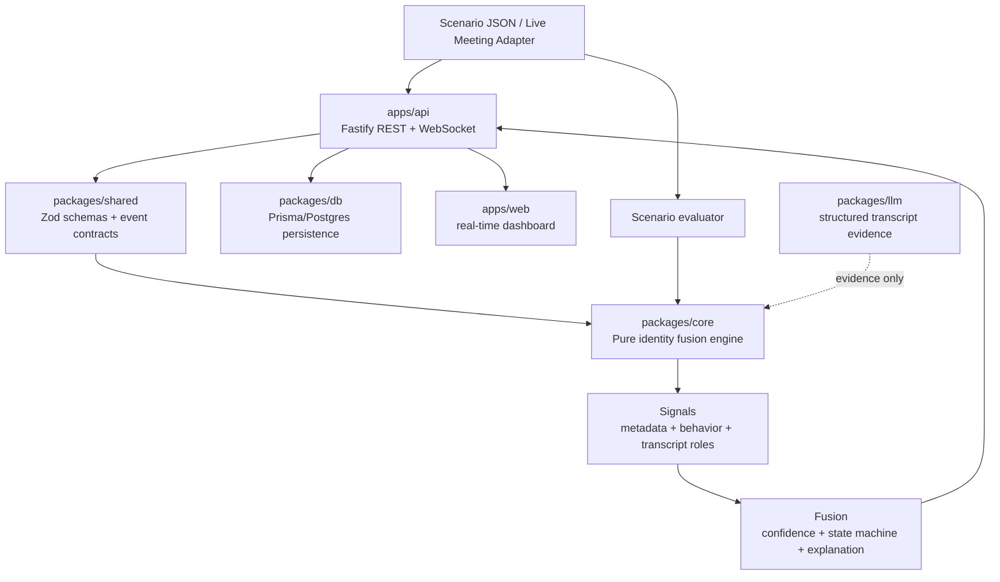

# Architecture

Sherlock's Candidate Identity Fusion Engine is designed as a monorepo with pure domain logic in the center and thin delivery layers around it.

## Package Responsibilities

| Area | Current status | Target responsibility |
| --- | --- | --- |
| `apps/web` | Present as a Next.js starter app | Demo dashboard for scenario replay, live participant rankings, confidence state, evidence, uncertainty, and evaluation results. |
| `apps/docs` | Present as a Next.js starter app | Optional documentation/demo surface. The blueprint target does not require this app. |
| `apps/api` | Missing | Fastify REST and WebSocket ingestion/broadcast service. It should validate events, call the core engine, persist snapshots, and broadcast candidate-state updates. |
| `packages/core` | Missing | Pure identity engine: metadata, behavior, transcript signal handling, fusion scoring, confidence state machine, explanations, scenario runner, and evaluator. |
| `packages/shared` | Missing | Zod schemas and TypeScript contracts for meetings, participants, events, evidence, candidate state, WebSocket messages, and scenario files. |
| `packages/db` | Present, minimal Prisma package | Prisma schema, migrations, typed client, and repository functions for meetings, participants, events, score snapshots, and scenario results. |
| `packages/llm` | Missing | Provider interface and adapters that convert transcript chunks into structured role evidence. It must not make final candidate decisions. |
| `packages/ui` | Present as shared React/Tailwind components | Shared visual components used by web surfaces, if helpful. |
| `packages/eslint-config` | Present | Shared lint configuration. |
| `packages/typescript-config` | Present | Shared TypeScript configuration. |
| `packages/tailwind-config` | Present | Shared Tailwind styles/configuration. |
| `scenarios` | Missing | JSON meeting simulations and expected outcomes for repeatable evaluation. |

## Event Flow

1. Meeting metadata and participant events arrive from a scenario replay or future live meeting adapter.
2. `apps/api` validates and normalizes the payload using `packages/shared` schemas.
3. `apps/api` applies the event to the current meeting session and calls `packages/core`.
4. `packages/core` extracts evidence, ranks participants, computes confidence, chooses a decision state, and returns explanations plus uncertainty.
5. `apps/api` persists events and score snapshots through `packages/db`.
6. `apps/api` broadcasts a `candidate_state_updated` message over WebSocket.
7. `apps/web` renders the selected candidate, confidence timeline, participant leaderboard, evidence, uncertainty, and raw event timeline.
8. The scenario evaluator replays the same events directly through `packages/core` to measure accuracy and edge-case behavior without API/UI dependencies.

## Mermaid Diagram

## Why `packages/core` Stays Pure

`packages/core` is the engineering center of the project. It decides which participant is likely to be the candidate, when evidence is insufficient, and when two participants are too close to choose safely.

Keeping it pure means it accepts plain TypeScript objects and returns plain TypeScript objects. It should not know how events arrived, where snapshots are stored, how dashboards render, or which LLM provider is available. That separation gives the project four advantages:

- Fast unit tests for the scoring, confidence, ambiguity, and explanation behavior.
- Repeatable scenario evaluation without starting Postgres, Fastify, WebSocket clients, or React.
- Safer future integrations because API, DB, dashboard, and LLM failures cannot leak into the decision logic.
- Clear auditability: the final candidate decision comes from deterministic evidence fusion, while LLM output is only one structured evidence source.
