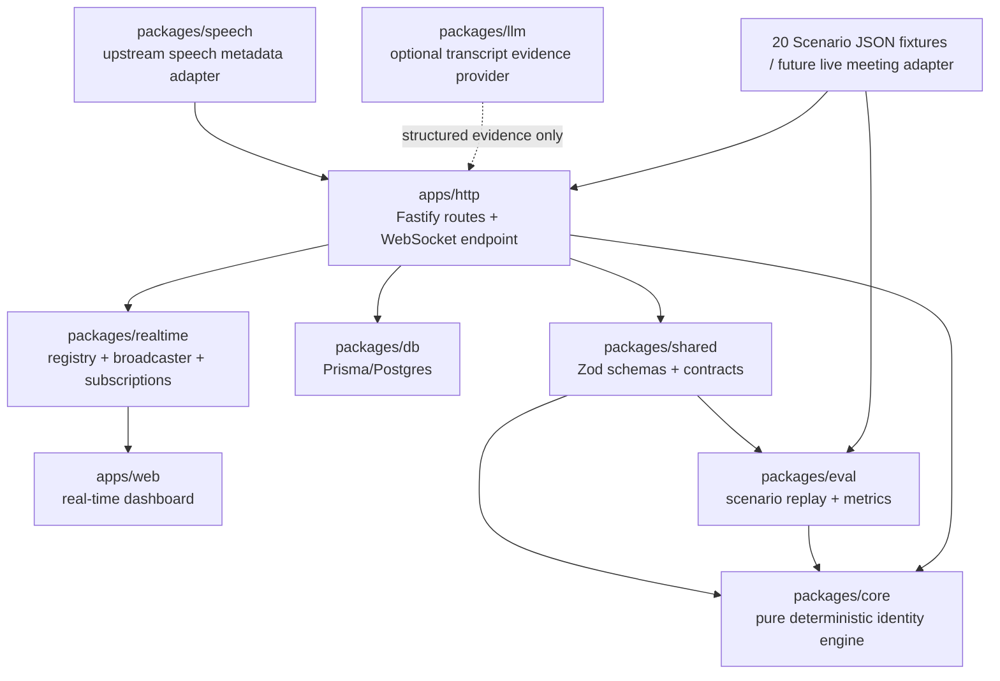
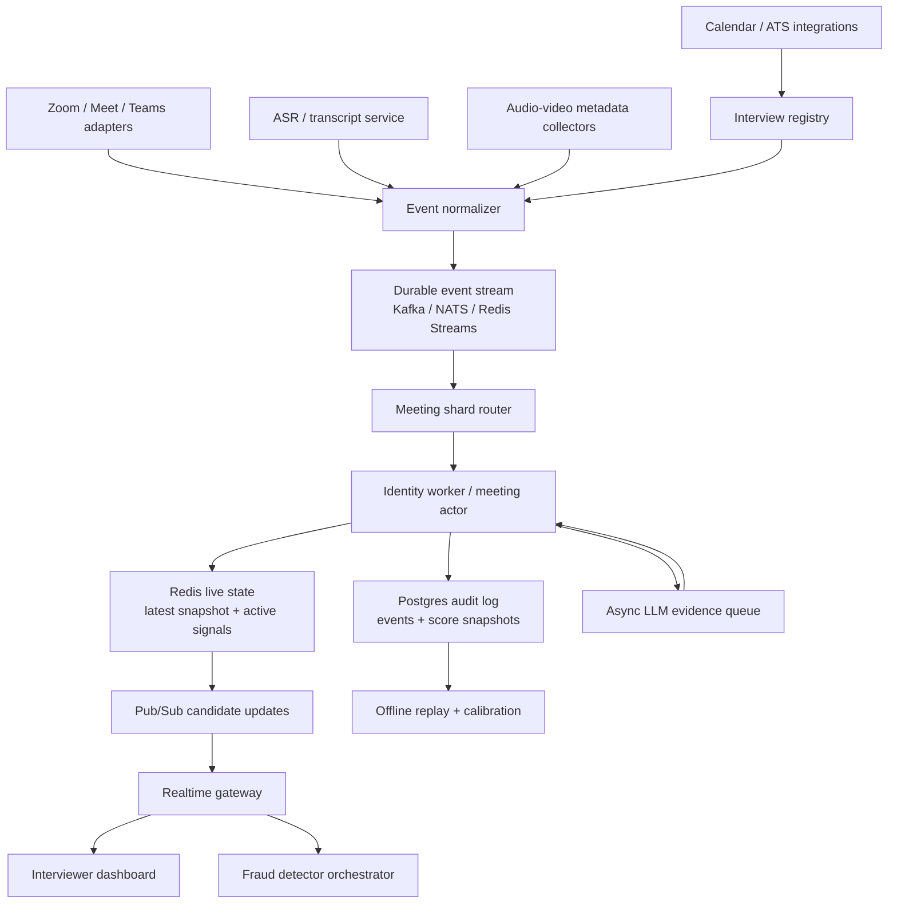
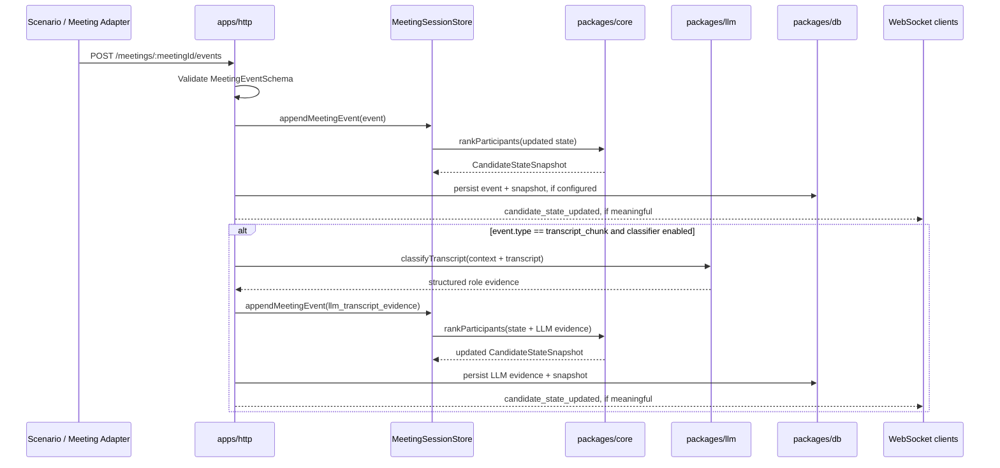
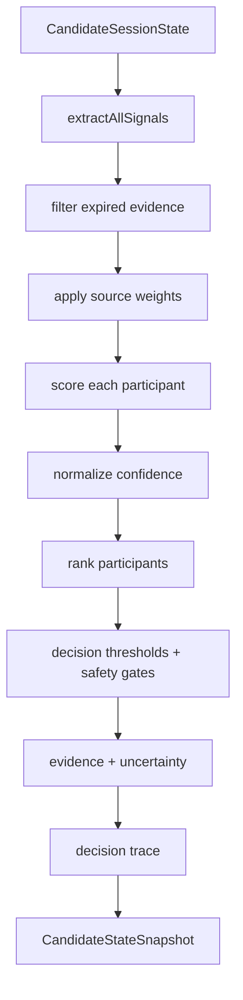

# Architecture

Sherlock's Candidate Identity Fusion Engine is designed as a monorepo with pure deterministic identity logic in the center and thin delivery layers around it.

This project solves candidate **stream routing**:

```text
Which participant stream should downstream Sherlock detectors analyze as the candidate?
```

It is not the complete interview-fraud product. In the larger Sherlock system, identity detection should sit before verification and fraud detection:

```text
Identity detection
    ↓
Candidate verification
    ↓
Fraud detection
    ↓
Real-time interviewer commentary / alerting / audit trail
```

For a detailed implementation walkthrough, see:

- [Core Fusion Identity Engine](./docs/core-fusion-identity-engine.md)
- [Scalability and Production Readiness](./docs/scalability-and-production-readiness.md)
- [Evaluation Report](./docs/evaluation-report.md)

---

## Current High-Level Design



The current demo has two execution paths:

1. **Scenario replay path**: `scenarios/*.json` → `packages/eval` → `packages/core` → metrics/dashboard timeline.
2. **Live-style ingestion path**: HTTP event ingestion → session state update → `packages/core` ranking → optional persistence → WebSocket broadcast.

Both paths use the same deterministic core.

---

## Production Evolution HLD

The current architecture is intentionally simple. A production system should evolve toward a stream-oriented architecture:



The production mental model is:

```text
meetingId → ordered event stream → one identity state machine → latest candidate snapshot
```

---

## Package Responsibilities

| Area | Current status | Target responsibility |
| --- | --- | --- |
| `apps/web` | Present with dashboard | Real-time interview dashboard for scenario replay, participant grid, candidate decision, evidence, uncertainty, criteria transparency, transcript, and timeline. |
| `apps/http` | Present with Fastify routes and WebSocket endpoint | Deployable backend transport/composition layer. It validates inputs, calls packages, persists snapshots when configured, and broadcasts candidate-state updates. In production, this should hand off to event streams/workers rather than owning all live state. |
| `packages/core` | Present with fusion engine | Pure deterministic identity engine: session state, signals, weighted fusion scoring, confidence/state decisions, ambiguity handling, explanations, and decision trace. |
| `packages/shared` | Present | Zod schemas and TypeScript contracts for meetings, participants, events, evidence, candidate state, WebSocket messages, and scenario files. |
| `packages/db` | Present | Prisma schema, migrations, typed client helper, and repository functions for meetings, participants, events, score snapshots, and scenario results. It persists; it does not compute identity. |
| `packages/llm` | Present with Gemini provider and mock provider | Provider interface and adapters that convert transcript chunks into structured role evidence. It must not make final candidate decisions. |
| `packages/realtime` | Present with registry and broadcaster helpers | Reusable realtime infrastructure only: connection registry, broadcaster, meeting subscriptions, typed broadcast helpers. In production this should be backed by Redis/NATS/Kafka pub-sub. |
| `packages/eval` | Present with scenario harness | Scenario replay, expected-vs-actual checks, evaluation metrics, CLI reporting, and future production replay calibration. |
| `packages/speech` | Present with collector scaffolding | Converts structured upstream speech activity and transcript observations into shared meeting events. It does not record raw audio or compute candidate identity. |
| `packages/ui` | Present | Shared visual components used by web surfaces. |
| `scenarios` | Present with 20 fixtures | JSON meeting simulations and expected outcomes for repeatable evaluation and dashboard replay. |

---

## Dependency Boundaries

Allowed dependency direction:

- `apps/http` may depend on `packages/shared`, `packages/core`, `packages/db`, `packages/realtime`, `packages/eval` for replay endpoints if needed, and `packages/llm` only as an evidence source.
- `apps/web` may depend on `packages/shared` and `packages/ui`.
- `packages/eval` may depend on `packages/shared` and `packages/core`.
- `packages/speech` may depend on `packages/shared` only.
- `packages/llm` may depend on `packages/shared` for transcript evidence schemas.
- `packages/db` may depend on `packages/shared` for persisted contract types.
- `packages/realtime` may depend on `packages/shared` for typed broadcast messages.
- `packages/core` may depend on `packages/shared`, but must not depend on apps, DB, realtime, UI, or LLM providers.

Forbidden dependency direction:

- Packages must not depend on apps.
- `packages/core` must not import Fastify, Prisma, WebSocket libraries, React, Gemini SDKs, server-specific APIs, filesystem state, network calls, or environment variables.
- `packages/realtime` must not become a separate deployable backend in the prototype.
- `packages/llm` must not select the candidate directly.
- `packages/db` must persist shared-shaped records and snapshots, not compute candidate identity.
- `packages/speech` must not import core, DB, Fastify, React, realtime, audio/CV libraries, or LLM providers. It maps structured metadata into events only.

Bun-first package export rule:

- Internal packages export direct TypeScript entrypoints such as `./index.ts`.
- Submodules export direct `.ts` files such as `./broadcaster.ts` or `./metrics.ts`.
- Runtime exports must not point to `dist/*.js`.
- New packages should follow the existing root-level module convention unless there is a strong reason to add `src/`.

---

## Current Event Flow

1. Meeting metadata and participant events arrive from a scenario replay or future live meeting adapter.
2. Future meeting-platform, bot, or ASR sources may pass structured speech observations through `packages/speech`, which emits `speaking_activity` and `transcript_chunk` events without recording raw audio.
3. `apps/http` validates and normalizes the payload using `packages/shared` schemas.
4. For `transcript_chunk` events, `apps/http` may optionally call `packages/llm` to create a structured `llm_transcript_evidence` event.
5. `apps/http` applies events to the current meeting session and calls `packages/core`.
6. `packages/core` extracts deterministic evidence signals, fuses them into confidence-ranked participants, handles ambiguity, and returns explanations/uncertainty.
7. `apps/http` persists events and score snapshots through `packages/db` when persistence is configured.
8. `apps/http` uses `packages/realtime` to broadcast a `candidate_state_updated` message over its WebSocket endpoint.
9. `apps/web` renders selected candidate, confidence timeline, participant leaderboard, evidence, uncertainty, transcript, criteria charts, and raw event timeline.
10. `packages/eval` replays scenario fixtures directly through `packages/core` to measure accuracy and edge-case behavior without API/UI dependencies.

---

## Ingestion and Transcript Classifier Flow



LLM failure must not break identity routing. The original transcript event is still processed by deterministic rules, and the LLM path can return a warning or retry later.

---

## Core Fusion LLD



Signal sources:

- metadata,
- interviewer exclusion,
- event timing/order/name-change,
- behavior,
- deterministic transcript rules,
- optional LLM transcript evidence,
- contradiction signals.

Default source weights:

| Source | Weight |
|---|---:|
| metadata | `0.30` |
| transcript | `0.30` |
| behavior | `0.18` |
| event | `0.12` |
| interviewer exclusion | `0.35` |
| contradiction | `0.40` |
| audio/video | `0.20` |

Decision states:

- `INSUFFICIENT_DATA`
- `POSSIBLE_CANDIDATE`
- `LIKELY_CANDIDATE`
- `CONFIRMED_CANDIDATE`
- `AMBIGUOUS`

`AMBIGUOUS` and `INSUFFICIENT_DATA` return `selectedCandidateId = null` so downstream detectors do not accidentally analyze the wrong stream.

---

## Why `apps/http` Stays Thin

`apps/http` is a transport and composition layer. It owns deployment concerns, server startup, HTTP routing, WebSocket endpoint registration, request validation, package orchestration, and error mapping.

It should not own candidate scoring, signal extraction, confidence thresholds, state transitions, explanation generation, scenario metrics, or transcript classification logic. Those responsibilities belong to packages so behavior can be tested without booting the backend server.

---

## Why `packages/core` Stays Pure

`packages/core` is the engineering center of the project. It decides which participant is likely to be the candidate, when evidence is insufficient, and when two participants are too close to choose safely.

Keeping it pure gives the project four advantages:

- Fast unit tests for scoring, confidence, ambiguity, and explanation behavior.
- Repeatable scenario evaluation without starting Postgres, Fastify, WebSocket clients, or React.
- Safer future integrations because API, DB, dashboard, and LLM failures cannot leak into decision logic.
- Clear auditability: the final candidate decision comes from deterministic evidence fusion, while LLM output is only one structured evidence source.

---

## Production Architecture Requirements

To scale beyond the prototype, add:

1. **Durable event stream** using Kafka, NATS JetStream, or Redis Streams.
2. **Redis live state** for latest candidate snapshot, active participant state, dedupe keys, locks, and pub-sub.
3. **Meeting actor workers** sharded by `meetingId` to maintain event ordering.
4. **Idempotency** using `source + sourceEventId + meetingId`.
5. **Incremental scoring** so new events update only affected participants rather than rescanning all events.
6. **Participant clustering** for rejoin/new participant ID/device-switch cases.
7. **Async LLM evidence queue** so transcript classification does not block live identity routing.
8. **Realtime gateway** backed by pub-sub instead of direct in-process WebSocket fan-out.
9. **Snapshot versioning** so downstream fraud detectors can attach their findings to the identity state used at detection time.
10. **Production replay evaluation** using labeled real interviews plus synthetic edge cases.

See [Scalability and Production Readiness](./docs/scalability-and-production-readiness.md) for detailed HLD, LLD, Redis/pub-sub design, production edge cases, and implementation roadmap.
