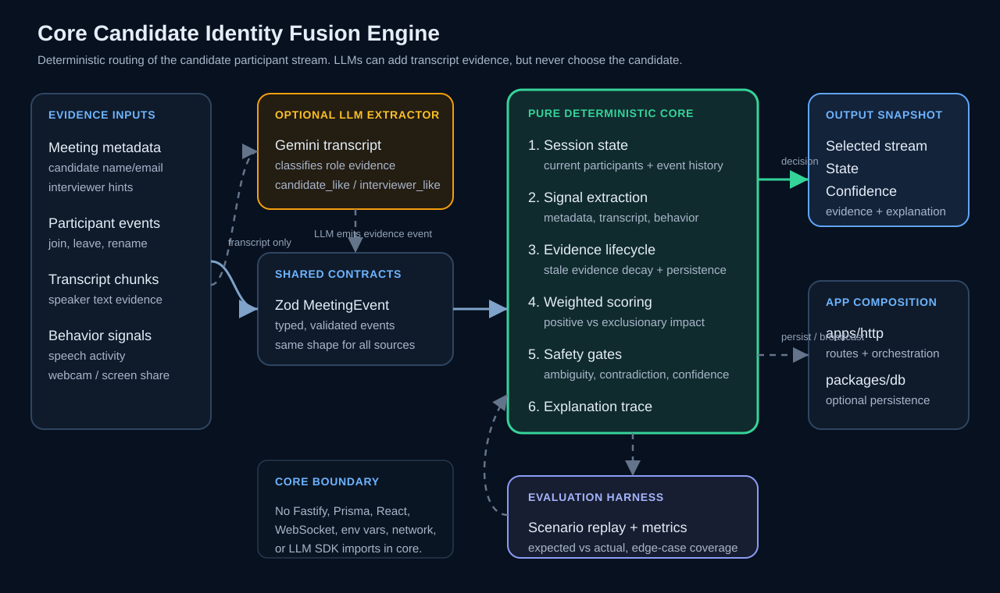

# Sherlock Candidate Identity Fusion Engine

Sherlock needs an identity routing layer that identifies the actual interview candidate in real time before downstream fraud detectors analyze audio, video, transcript, behavior, or device signals.

This repository implements a deterministic Candidate Identity Fusion Engine that fuses metadata, participant events, transcript evidence, behavior signals, confidence scoring, explanations, and scenario evaluation.

## Where this fits in Sherlock

Sherlock's broader product detects interview fraud in real time, including AI-copilot usage, deepfakes, proxy candidates, suspicious behavior, and related interview-integrity risks.

This repository focuses on the prerequisite routing problem:

```text
Identity detection
    ↓
Candidate verification
    ↓
Fraud detection
    ↓
Real-time interviewer commentary / alerting / audit trail
```

The engine answers:

> Which participant stream should Sherlock treat as the candidate stream right now?

It does not make a fraud verdict. It does not verify legal human identity. It does not perform face recognition, voice biometrics, liveness checks, deepfake detection, or AI-copilot detection. Those are downstream systems that become safer and more accurate once the candidate stream is correctly identified.

## Problem Statement

Interview fraud detectors are only useful when Sherlock knows which meeting participant is the candidate. In real calls, the candidate may join as `MacBook Pro`, use the wrong display name, arrive late, change names, rejoin, or share the room with interviewers and observers.

This project continuously ranks participants, assigns confidence, explains why a participant was selected, and safely returns `INSUFFICIENT_DATA` or `AMBIGUOUS` when evidence is too weak or too close.

## Core thesis

The final identity decision should be deterministic, not a black-box LLM decision.

LLMs may help classify transcript chunks into structured role evidence, but the deterministic fusion engine remains the final decision-maker. This keeps candidate routing explainable, reproducible, testable, auditable, and resilient to model latency or provider failure.

## Project Docs

Start here:

- [Core Fusion Identity Engine](./docs/core-fusion-identity-engine.md) — full implementation walkthrough with ingestion flow, signal extraction, scoring formula, transcript classifier flow, confidence generation, and scenario examples.
- [Scalability and Production Readiness](./docs/scalability-and-production-readiness.md) — production HLD/LLD, Redis/pub-sub/event-stream design, scaling challenges, real-time edge cases, and how identity routing fits before verification and fraud detection.
- [Architecture](./ARCHITECTURE.md) — package boundaries, event flow, dependency rules, current HLD, and production evolution.
- [Evaluation Report](./docs/evaluation-report.md) — 20-scenario replay suite, metrics, edge cases, limitations, and results.
- [Reproducibility Guide](./docs/reproducibility.md) — setup, local commands, Docker demo, optional Gemini configuration, and troubleshooting.

## Architecture Overview

The project is a Bun/Turborepo monorepo with pure identity logic at the center:



The core identity engine is intentionally deterministic. `apps/http` receives and validates meeting events, optional Gemini classification converts transcript chunks into structured role evidence, and then `packages/core` applies the same deterministic signal extraction, weighting, safety gates, confidence thresholds, and explanation logic for every run. The LLM never selects the candidate; it only contributes evidence that the core engine can accept, reject, or ignore.

- `packages/shared`: Zod schemas and TypeScript contracts for meetings, participants, events, evidence, WebSocket messages, and scenarios.
- `packages/core`: pure session state, deterministic signal extraction, fusion scoring, confidence/state decisions, ambiguity handling, explanations, and decision trace.
- `packages/db`: Prisma/Postgres persistence for meetings, participants, events, score snapshots, and scenario results.
- `packages/llm`: structured transcript role evidence adapters with deterministic fallback rules.
- `packages/realtime`: WebSocket subscription registry and typed broadcast helpers.
- `packages/eval`: scenario replay, metrics, expected-vs-actual checks, and CLI reporting.
- `packages/speech`: speech metadata collector scaffolding that maps upstream speech/transcript observations into shared meeting events.
- `apps/http`: Fastify backend that validates inputs, applies events, calls the core engine, optionally persists snapshots, and broadcasts live candidate state.
- `apps/web`: real-time dashboard for scenario replay, participant leaderboard, evidence, uncertainty, confidence timeline, and evaluation summaries.
- `scenarios`: replayable JSON edge cases with expected outcomes.

See [ARCHITECTURE.md](./ARCHITECTURE.md) for package responsibilities, dependency boundaries, event flow, and diagrams.

## What the engine produces

Each update returns a `CandidateStateSnapshot`:

```ts
{
  meetingId: string;
  selectedCandidateId: string | null;
  confidence: number;
  state:
    | "INSUFFICIENT_DATA"
    | "POSSIBLE_CANDIDATE"
    | "LIKELY_CANDIDATE"
    | "CONFIRMED_CANDIDATE"
    | "AMBIGUOUS";
  participants: ParticipantScore[];
  evidence: EvidenceItem[];
  uncertainty: string[];
  decisionTrace?: CandidateDecisionTrace;
}
```

The dashboard explains four layers:

1. Raw events: what happened in the meeting.
2. Signals: what evidence was extracted.
3. Fusion: how weighted evidence affected each participant.
4. Safety gates: why the engine selected, refused, or delayed confirmation.

## Evaluation Summary

The scenario suite covers 20 edge cases, including generic device names, wrong candidate names, multiple interviewers, silent observers, display-name changes, late joins, ambiguous unknown participants, candidate rejoin, no transcript, weak transcript, strong self-identification, interviewer/candidate conflicts, evidence decay, stable confirmation, and optional LLM evidence.

Reported evaluation output:

```text
Scenarios: 20/20 passed
Top-1 accuracy: 100%
State accuracy: 100%
False interviewer selections: 0
Avg final confidence: 0.595
Avg evidence count: 6
Ambiguous handled: 1/1
Insufficient-data handled: 8/8
Avg time to likely: 25.5s
Avg time to confirmed: 90s
```

Run the evaluator with:

```sh
bun --filter '@sherlock/eval' eval
```

## Demo Video

<video src="./docs/sherlock-demo.mp4" controls width="100%">
  <a href="./docs/sherlock-demo.mp4">Watch the Sherlock demo walkthrough</a>
</video>

[Download the original MOV](./docs/sherlock-demo.mov)

## Phase Plan Summary

| Phase | Goal | Status |
| --- | --- | --- |
| 0 | Product scope, thesis, acceptance criteria, architecture docs | Done |
| 1 | Bun/Turborepo workspace contracts and package boundary alignment | Done |
| 2 | Prisma/Postgres persistence package | Done |
| 3 | Pure core domain model and deterministic signal extractors | Done |
| 4 | Fusion engine, confidence, ambiguity, and explanations | Done |
| 5 | Scenario simulator and evaluation harness | Done |
| 5.5 | Core hardening, transcript specificity, temporal stability, evidence decay, and speech metadata scaffolding | Done |
| 6 | Fastify ingestion and WebSocket broadcast | Done |
| 7 | Optional LLM transcript classifier evidence package | Done |
| 8 | React real-time dashboard and demo experience | Done |
| 9 | Final evaluation report, reproducibility pass, and docs polish | Done |
| 10 | Final verification and documentation cleanup | Done |

## Current Repository Shape

- `apps/web`: Next.js real-time interview dashboard for scenario replay, candidate decision display, evidence, and uncertainty.
- `apps/http`: Fastify ingestion and WebSocket composition app.
- `packages/ui`: shared React/Tailwind component package.
- `packages/shared`: Zod schemas and TypeScript contracts.
- `packages/core`: pure identity engine with deterministic signal extraction and fusion decision snapshots.
- `packages/db`: Prisma/Postgres schema, client helper, and repository plumbing.
- `packages/realtime`: reusable realtime registry and broadcaster helpers.
- `packages/eval`: scenario replay, metrics, expected-vs-actual checks, and CLI reporting.
- `packages/speech`: speech metadata mapping, event factory, collector, and optional injected HTTP sink.
- `packages/llm`: Gemini-backed structured transcript role evidence extraction with mock-provider tests.
- `packages/eslint-config`: shared ESLint configuration.
- `packages/typescript-config`: shared TypeScript configuration.
- `packages/tailwind-config`: shared Tailwind styles.
- `docs/implementation-blueprint.pdf` and `docs/implementation-blueprint.docx`: implementation blueprint.

## Commands

Use Bun from the repository root:

```sh
bun install
bun run check-types
bun run build
bun run lint
```

Useful package-level commands:

```sh
bun --filter web dev
bun --filter web check-types
bun --filter web build
bun --filter web test
bun --filter http check-types
bun --filter http test
bun --filter http dev
bun --filter '@sherlock/shared' check-types
bun --filter '@sherlock/core' check-types
bun --filter '@sherlock/core' test
bun --filter '@sherlock/llm' check-types
bun --filter '@sherlock/llm' test
bun --filter '@sherlock/realtime' check-types
bun --filter '@sherlock/eval' check-types
bun --filter '@sherlock/eval' test
bun --filter '@sherlock/eval' eval
bun --filter '@sherlock/speech' check-types
bun --filter '@sherlock/speech' test
bun --filter '@sherlock/db' db:generate
bun --filter '@sherlock/db' db:migrate
bun --filter '@sherlock/db' check-types
bun --filter '@sherlock/db' test
bun --filter @repo/ui run check-types
```

## Optional Gemini Transcript Classification

Gemini is used only to extract structured transcript role evidence. It does not select the candidate.

By default, the backend accepts transcript and LLM-evidence events but does not call Gemini automatically.

To enable real Gemini classification when `transcript_chunk` events arrive:

```sh
ENABLE_LLM_TRANSCRIPT_CLASSIFIER=true
GEMINI_API_KEY=your_key_here
GEMINI_MODEL=gemini-flash-lite-latest
bun --filter http dev
```

With Docker:

```sh
ENABLE_LLM_TRANSCRIPT_CLASSIFIER=true GEMINI_API_KEY=your_key_here docker compose up
```

## Docker Demo

Run the full local application stack:

```sh
docker compose up
```

This starts:

- Postgres on `localhost:5432`
- Prisma migrations before backend startup
- Fastify backend on `http://localhost:3001`
- Next.js dashboard on `http://localhost:3000`

Open `http://localhost:3000`, choose a scenario, and start replay. The web app creates a meeting through `apps/http`, posts fixture events, listens for `candidate_state_updated` over WebSocket, and falls back to snapshot polling if the socket is unavailable.

Manual Bun fallback:

```sh
# terminal 1
HOST=127.0.0.1 PORT=3001 bun --filter http dev

# terminal 2
bun --filter web dev
```

Postgres only:

```sh
docker compose up postgres
```

## Project Status

The repository is ready after running the verification commands.

Primary implementation docs:

- [Core Fusion Identity Engine](./docs/core-fusion-identity-engine.md)
- [Scalability and Production Readiness](./docs/scalability-and-production-readiness.md)
- [Architecture](./ARCHITECTURE.md)
- [Evaluation Report](./docs/evaluation-report.md)
- [Reproducibility Guide](./docs/reproducibility.md)

The engine identifies the candidate participant stream; it does not verify legal human identity or make cheating/fraud verdicts.
