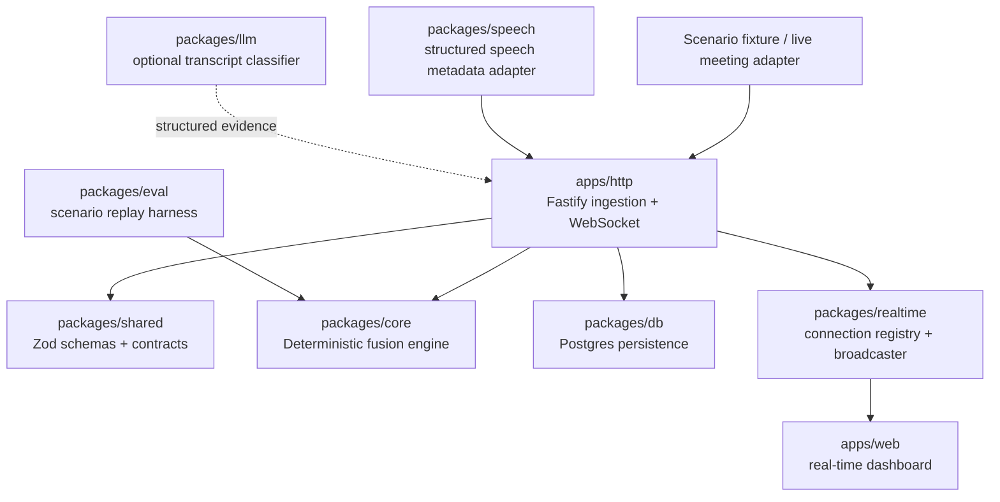
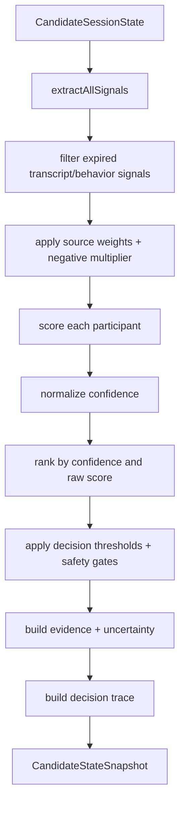
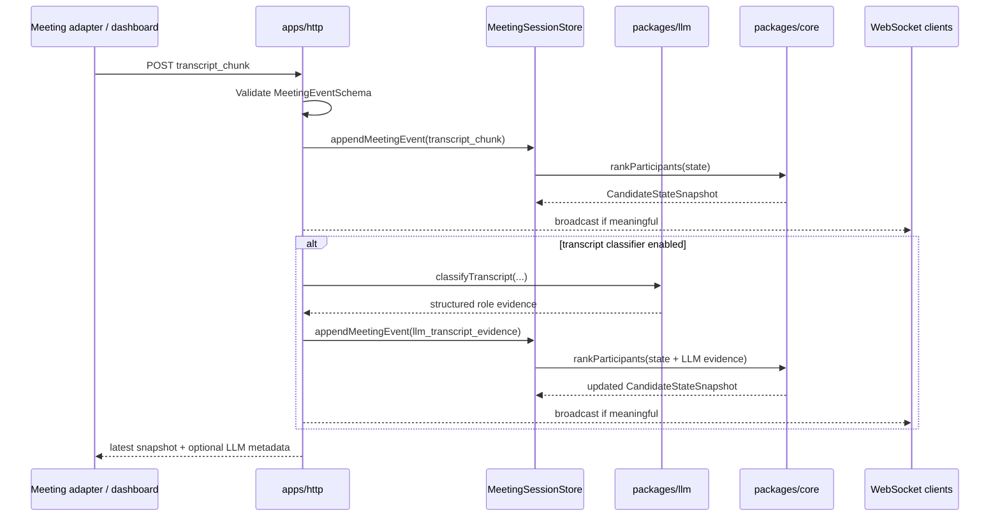

# Core Fusion Identity Engine

This document explains the implementation of the Sherlock Candidate Identity Fusion Engine: what data enters the system, how events are ingested, how deterministic signals are extracted, how confidence is computed, how the transcript classifier participates, and how the engine reaches a final candidate routing state.

The important framing is this:

> The engine identifies the candidate **participant stream** that downstream Sherlock fraud detectors should analyze. It does not perform legal identity verification, face matching, voice biometrics, deepfake detection, AI-copilot detection, or a fraud verdict by itself.

In the larger Sherlock product, this engine sits before the fraud stack:

```text
Identity routing
    ↓
Candidate verification signals
    ↓
Fraud detection signals
    ↓
Reviewer-facing explanation / alert / commentary
```

Sherlock can only run deepfake, voice, behavior, AI-copilot, and proxy-candidate detectors correctly after it knows which audio/video/transcript stream belongs to the candidate.

---

## 1. Core design principles

### 1.1 Multiple weak signals, not one brittle rule

The candidate may join as `MacBook Pro`, use a nickname, change their display name, arrive late, or share a meeting with interviewers and observers. A single rule like `displayName === candidateName` is not enough.

The engine therefore fuses several classes of evidence:

- meeting metadata,
- participant metadata,
- join/leave/display-name events,
- speech activity,
- webcam/screen-share behavior,
- deterministic transcript rules,
- optional LLM-generated transcript role evidence,
- interviewer exclusion rules,
- contradiction rules,
- safety gates.

### 1.2 Deterministic final decision

The final candidate decision is made by `packages/core`, not by an LLM.

LLMs are allowed to produce structured transcript evidence, but they are not allowed to select the candidate. This is intentional because the identity routing layer must be:

- explainable,
- repeatable,
- testable in a scenario harness,
- debuggable after an incident,
- safe under missing or conflicting evidence,
- independent from model latency, cost, or hallucination.

### 1.3 Graceful uncertainty is a feature

The engine can return:

- `INSUFFICIENT_DATA` when evidence is weak,
- `AMBIGUOUS` when top participants are too close,
- `POSSIBLE_CANDIDATE` when there is some evidence but not enough,
- `LIKELY_CANDIDATE` when evidence is strong but not stable enough for confirmation,
- `CONFIRMED_CANDIDATE` when evidence is strong, stable, and non-contradictory.

It is better to delay or refuse candidate routing than to confidently analyze the wrong participant stream.

---

## 2. Current high-level architecture



The current prototype has two ways to drive the engine:

1. **Scenario replay** through `packages/eval` and the dashboard.
2. **HTTP event ingestion** through `apps/http`.

Both paths ultimately call the same deterministic core.

---

## 3. Low-level package map

| Package / app | Responsibility |
|---|---|
| `packages/shared` | Zod schemas and TypeScript contracts for meetings, participants, events, evidence, candidate states, snapshots, and scenarios. |
| `packages/core` | Pure candidate identity engine: session state, signal extraction, weighted scoring, confidence, safety gates, explanations, and decision trace. |
| `packages/llm` | Optional transcript role classifier. Converts transcript chunks into structured role evidence. Does not select the candidate. |
| `packages/speech` | Converts upstream ASR/speech observations into Sherlock meeting events. Does not record raw audio or compute identity. |
| `packages/eval` | Replays scenario fixtures through the core engine and computes metrics. |
| `packages/db` | Persists meetings, participants, events, snapshots, and scenario results. Does not compute identity. |
| `packages/realtime` | WebSocket connection registry and broadcast helpers. |
| `apps/http` | Fastify transport/composition layer: validates payloads, updates sessions, persists events, broadcasts snapshots. |
| `apps/web` | Dashboard for replay, participant leaderboard, confidence, evidence, uncertainty, transcript, and timeline. |

The key boundary is this: `packages/core` stays pure. It accepts plain objects and returns plain objects. It does not know about HTTP, Postgres, WebSockets, React, Gemini, files, or environment variables.

---

## 4. Input model

### 4.1 Meeting metadata

The meeting object contains:

```ts
{
  id: string;
  candidateName: string;
  candidateEmail?: string;
  scheduledStart?: string;
  interviewerNames: string[];
  interviewerEmails: string[];
  companyDomains: string[];
}
```

The candidate name and email are positive identity anchors. Interviewer names, interviewer emails, and company domains are exclusion anchors.

### 4.2 Participant metadata

Each participant contains:

```ts
{
  id: string;
  meetingId: string;
  displayName: string;
  email?: string;
  currentName?: string;
  joinedAtSec?: number;
  leftAtSec?: number;
  isKnownInterviewerHint: boolean;
}
```

The participant ID is the stream being routed. A participant is not necessarily the human identity; a human can rejoin and receive a new platform participant ID in production. The prototype currently evaluates participant streams.

### 4.3 Meeting events

Supported event types:

| Event type | Purpose |
|---|---|
| `participant_joined` | Records join time and enables join-order/timing signals. |
| `participant_left` | Records leave time. |
| `display_name_changed` | Updates current display name. Useful for generic-device-to-real-name cases. |
| `webcam_changed` | Adds weak behavior signal when webcam is on. |
| `screen_share_changed` | Adds weak behavior signal when participant shares screen. |
| `speaking_activity` | Adds weak behavior signal from speaking duration. |
| `transcript_chunk` | Allows deterministic transcript role evidence extraction. |
| `llm_transcript_evidence` | Optional structured LLM evidence generated from a transcript chunk. |

---

## 5. HTTP ingestion flow

### 5.1 Meeting creation

`POST /meetings` accepts a meeting and participants.

Flow:

```text
POST /meetings
    ↓
Validate meeting with MeetingSchema
    ↓
Validate participants with ParticipantSchema
    ↓
createMeetingSession(meeting, participants)
    ↓
createInitialSessionState(...)
    ↓
rankParticipants(initial state)
    ↓
Return initial CandidateStateSnapshot
```

At this point there may be no events yet, so the engine may return `INSUFFICIENT_DATA`, or a likely state if metadata is already strong enough.

### 5.2 Event ingestion

`POST /meetings/:meetingId/events` accepts one meeting event at a time.

```text
POST /meetings/:meetingId/events
    ↓
Validate event with MeetingEventSchema
    ↓
Fetch previous snapshot
    ↓
appendMeetingEvent(meetingId, event)
    ↓
applyMeetingEvent(session.state, event)
    ↓
rankParticipants(updated state)
    ↓
Persist event + snapshot if DB is configured
    ↓
Broadcast candidate_state_updated if snapshot changed meaningfully
    ↓
If transcript classifier is enabled and event is transcript_chunk:
        classify transcript
        create llm_transcript_evidence event
        append LLM evidence event
        re-rank participants
        persist + broadcast again if meaningful
    ↓
Return latest snapshot
```

### 5.3 Snapshot broadcasting policy

The backend broadcasts only when the candidate state meaningfully changes:

- state changed,
- selected candidate ID changed,
- confidence moved by at least `0.03`,
- evidence count changed,
- uncertainty count changed.

This avoids flooding the dashboard with tiny updates while still keeping the identity state live.

---

## 6. Session state update flow

The core state stores:

```ts
CandidateSessionState = {
  meeting;
  participants;
  events;
  currentDisplayNames;
  participantSpeakingDurationSec;
  webcamOnByParticipant;
  screenShareByParticipant;
  transcriptSnippetsByParticipant;
  joinedAtSecByParticipant;
  leftAtSecByParticipant;
  originalDisplayNames;
}
```

When an event arrives:

| Event | State update |
|---|---|
| `participant_joined` | `joinedAtSecByParticipant[participantId] = timestampSec` |
| `participant_left` | `leftAtSecByParticipant[participantId] = timestampSec` |
| `display_name_changed` | `currentDisplayNames[participantId] = newDisplayName` |
| `webcam_changed` | `webcamOnByParticipant[participantId] = webcamOn` |
| `screen_share_changed` | `screenShareByParticipant[participantId] = sharing` |
| `speaking_activity` | Adds `durationSec` to accumulated speaking duration |
| `transcript_chunk` | Appends transcript text for that participant |

After state is updated, `rankParticipants(state)` calls `fuseCandidateSignals(state)`.

---

## 7. Fusion pipeline



### 7.1 Signal extraction

`extractAllSignals(state)` combines:

```ts
[
  ...extractMetadataSignals(state),
  ...extractInterviewerExclusionSignals(state),
  ...extractEventSignals(state),
  ...extractBehaviorSignals(state),
  ...extractTranscriptSignals(state),
  ...extractLlmTranscriptEvidenceSignals(state),
  ...extractContradictionSignals(baseSignals)
]
```

Contradiction signals are computed after base signals because contradictions need to compare candidate-like and interviewer-like evidence for the same participant.

### 7.2 Evidence decay

Some signals are persistent; others expire.

| Signal type | TTL |
|---|---:|
| Transcript evidence | 300 seconds |
| Behavior evidence | 120 seconds |
| Persistent metadata | Does not expire |

This prevents stale transcript or old behavior from controlling the decision forever.

### 7.3 Source weights

Default source weights:

| Source | Weight | Meaning |
|---|---:|---|
| `metadata` | `0.30` | Candidate/interviewer name/email/domain evidence. |
| `transcript` | `0.30` | Candidate-like or interviewer-like language. |
| `behavior` | `0.18` | Speaking, webcam, screen share. |
| `event` | `0.12` | Join timing, join order, display-name change. |
| `interviewer_exclusion` | `0.35` | Strong negative evidence for known interviewers. |
| `contradiction` | `0.40` | Strong penalty when evidence conflicts. |
| `audio_video` | `0.20` | Reserved for future audio/video signals. |

Negative signals receive an additional multiplier of `1.15`, so exclusionary evidence is slightly stronger than equivalent positive evidence.

### 7.4 Participant score

For each participant:

```text
weightedImpact = signal.strength × sourceWeight
negative weightedImpact = -signal.strength × sourceWeight × negativeSignalMultiplier

positiveWeight = sum(all positive weighted impacts)
negativeWeight = absolute sum(all negative weighted impacts)
rawScore = positiveWeight - negativeWeight
```

### 7.5 Confidence normalization

The current confidence function is:

```text
if positiveWeight <= 0 or rawScore <= 0:
    confidence = 0
else:
    evidenceCoverage = clamp(positiveWeight / 0.6)
    purity = positiveWeight / (positiveWeight + negativeWeight + 0.15)
    confidence = clamp(0.35 + 0.65 × evidenceCoverage × purity)
```

Meaning:

- **Evidence coverage** rewards enough positive evidence.
- **Purity** penalizes contradictory or negative evidence.
- The `+ 0.15` smoothing term prevents weak isolated positive evidence from jumping too high.

### 7.6 Ranking

Participants are ranked by:

1. confidence,
2. raw score as tie-breaker.

The top participant is compared to the second participant using the confidence margin.

---

## 8. Signal catalogue

### 8.1 Metadata signals

| Signal | Direction | Strength | Source | Description |
|---|---|---:|---|---|
| `candidate_name_exact` | positive | `0.95` | metadata | Display name exactly matches candidate name. |
| `candidate_name_partial` | positive | `0.45 + tokenOverlap × 0.25` | metadata | Display name shares candidate-name tokens. |
| `candidate_email_exact` | positive | `1.00` | metadata | Participant email exactly matches candidate email. |
| `generic_device_name` | neutral | `0.20` | metadata | Display name looks like `MacBook Pro`, `iPhone`, `Guest`, etc. |
| `interviewer_name_match` | negative | `0.80` | metadata | Display name resembles known interviewer name. |
| `interviewer_email_match` | negative | `0.90` | metadata | Email matches interviewer email. |
| `company_domain_email` | negative | `0.55` | metadata | Participant uses company domain while candidate appears external/different. |

### 8.2 Interviewer exclusion signals

| Signal | Direction | Strength | Source | Description |
|---|---|---:|---|---|
| `interviewer_email_match` | negative | `0.95` | interviewer_exclusion | Strong exclusion using known interviewer email. |
| `interviewer_name_match` | negative | `0.85` | interviewer_exclusion | Strong exclusion using known interviewer name. |
| `company_domain_email` | negative | `0.65` | interviewer_exclusion | Excludes likely company/interviewer participants. |

### 8.3 Event signals

| Signal | Direction | Strength | Source | Description |
|---|---|---:|---|---|
| `join_timing` | positive | `0.25` | event | Participant joined close to scheduled interview start. |
| `join_timing` | neutral | `0.10` | event | Participant joined much earlier than scheduled start. |
| `join_order` | positive | `0.20` | event | Participant joined after multiple known interviewers. |
| `display_name_change` | positive | `0.45` | event | Participant changed from generic device name to identifying name. |

### 8.4 Behavior signals

| Signal | Direction | Strength | Source | Description |
|---|---|---:|---|---|
| `speaking_activity` | positive | `min(0.35, 0.1 + speakingDurationSec / 600)` | behavior | Participant has spoken during the meeting. |
| `webcam_on` | positive | `0.12` | behavior | Participant webcam is enabled. |
| `screen_share` | positive | `0.10` | behavior | Participant is sharing screen. |
| `long_silence` | neutral | `0.15` | behavior | Participant has no speech after enough meeting time. |

### 8.5 Transcript signals

| Signal | Direction | Strength | Source | Description |
|---|---|---:|---|---|
| `candidate_self_identification` | positive | `0.70` | transcript | Explicit candidate self-identification. |
| `candidate_name_spoken` | positive | `0.65 + tokenOverlap × 0.25` | transcript | Speaker says candidate name in self-introduction. |
| `candidate_experience_statement` | positive | `0.38` | transcript | Candidate-like experience language. |
| `candidate_project_statement` | positive | `0.25` | transcript | Generic project language. Weak by itself. |
| `interviewer_question_prompt` | negative | `0.65` | transcript | Interviewer-style questioning. |
| `interviewer_role_description` | negative | `0.50` | transcript | Role/team description language. |
| `interviewer_control_language` | negative | `0.55` | transcript | Controls interview flow, e.g. next question. |
| `transcript_role_uncertain` | neutral | `0.10` | transcript | Transcript exists but role is unclear. |

### 8.6 LLM transcript evidence signals

The LLM classifier returns structured evidence such as:

- candidate-like,
- interviewer-like,
- observer/admin-like,
- uncertain.

The core maps the LLM output back into deterministic signal kinds. LLM evidence strength is converted using:

| LLM strength | Multiplier |
|---|---:|
| strong | `0.70` |
| medium | `0.48` |
| weak | `0.28` |

Final LLM signal strength:

```text
item.confidence × strengthMultiplier
```

If the classifier says `shouldAffectCandidateIdentity = false`, the engine records only neutral uncertainty.

### 8.7 Contradiction signals

| Signal | Direction | Strength | Source | Description |
|---|---|---:|---|---|
| `candidate_interviewer_metadata_conflict` | negative | `0.85` | contradiction | Candidate metadata and interviewer/company metadata both match. |
| `candidate_transcript_interviewer_metadata_conflict` | negative | `0.80` | contradiction | Candidate-like transcript appears on an interviewer-like participant. |
| `mixed_transcript_role_conflict` | negative | `0.65` | contradiction | Same participant has candidate-like and interviewer-like transcript evidence. |

---

## 9. Decision thresholds

| Threshold | Value | Purpose |
|---|---:|---|
| `minimumPositiveEvidence` | `0.15` | Avoid choosing participants with almost no positive evidence. |
| `insufficient` | `0.55` | Below this confidence, return `INSUFFICIENT_DATA`. |
| `likely` | `0.75` | Below this but above insufficient, return `POSSIBLE_CANDIDATE`. |
| `confirmed` | `0.90` | Candidate may be confirmed only above this threshold. |
| `ambiguousMargin` | `0.15` | If top two candidates are closer than this, return `AMBIGUOUS`. |
| `strongInterviewerExclusion` | `0.80` | Blocks confirmation when interviewer evidence is strong. |
| `strongContradiction` | `0.70` | Blocks confirmation when contradiction is strong. |
| `confirmationMinStableSec` | `60` | Confirmation requires evidence stability over time. |
| `confirmationMinEvidenceEvents` | `2` | Confirmation requires multiple evidence events. |
| `confirmationMinDistinctSignalSources` | `2` | Confirmation requires more than one source type. |

---

## 10. Decision state rules

The decision state is selected as follows:

```text
No participant exists
    → INSUFFICIENT_DATA

Top participant has less than minimum positive evidence
    → INSUFFICIENT_DATA

Top confidence < insufficient threshold
    → INSUFFICIENT_DATA

Second participant has enough evidence and margin < ambiguous margin
    → AMBIGUOUS

Top confidence < likely threshold
    → POSSIBLE_CANDIDATE

Top confidence >= confirmed threshold
AND margin is safe
AND no strong interviewer exclusion
AND no strong contradiction
AND confirmation stability rules pass
    → CONFIRMED_CANDIDATE

Otherwise
    → LIKELY_CANDIDATE
```

For `AMBIGUOUS` and `INSUFFICIENT_DATA`, the selected candidate ID is `null`. Fraud detectors should not route candidate-only analysis to any single participant in those states.

---

## 11. Transcript classifier flow

The LLM transcript classifier is optional and conservative.

### 11.1 Why it exists

Deterministic phrase rules are good for simple cases, but transcripts may contain nuanced language. The LLM can help classify whether a chunk sounds:

- candidate-like,
- interviewer-like,
- observer/admin-like,
- uncertain.

### 11.2 Why it does not decide identity

The prompt explicitly frames the LLM as an evidence extractor:

```text
Your task is NOT to decide who the candidate is.
Your task is only to classify this transcript chunk into structured role evidence.
The deterministic fusion engine will make the final candidate decision later.
```

This prevents a black-box model from becoming the source of truth.

### 11.3 LLM ingestion path



### 11.4 Failure behavior

If the LLM classifier fails:

- the original transcript event is still accepted,
- deterministic core scoring still runs,
- the HTTP response may include an LLM warning,
- candidate identity routing does not break.

This is important for real-time systems because LLM calls can be slow, expensive, rate-limited, or unavailable.

---

## 12. Scenario walkthroughs

The following examples use the current weights and confidence formula. Values are rounded for readability.

### Scenario A — Clean exact name and email match

Equivalent fixture: `01_exact_name_match`.

#### Available meeting metadata

```json
{
  "candidateName": "Ritika Gupta",
  "candidateEmail": "ritika@example.com",
  "interviewerNames": ["Priya Sharma"],
  "interviewerEmails": ["priya@sherlock.ai"],
  "companyDomains": ["sherlock.ai"]
}
```

#### Initial participants

| Participant | Display name | Email | Known interviewer? |
|---|---|---|---|
| `p_candidate` | `Ritika Gupta` | `ritika@example.com` | false |
| `p_interviewer` | `Priya Sharma` | `priya@sherlock.ai` | true |

#### Extracted candidate signals

| Signal | Direction | Strength | Source weight | Weighted impact |
|---|---|---:|---:|---:|
| `candidate_name_exact` | positive | `0.95` | `0.30` | `+0.285` |
| `candidate_email_exact` | positive | `1.00` | `0.30` | `+0.300` |

Approximate candidate score:

```text
positiveWeight = 0.585
negativeWeight = 0
rawScore = 0.585
confidence ≈ 0.85
```

Expected state: `LIKELY_CANDIDATE`.

Why not always confirmed instantly? Confirmation requires stability across time, enough evidence events, and enough distinct signal sources. Metadata alone can make the candidate likely, but confirmation is intentionally stricter.

---

### Scenario B — Candidate joins as `MacBook Pro` with weak transcript

Fixture: `02_generic_device_name`.

#### Available meeting metadata

```json
{
  "candidateName": "Ritika Gupta",
  "candidateEmail": "ritika@example.com",
  "interviewerNames": ["Priya Sharma"],
  "interviewerEmails": ["priya@sherlock.ai"],
  "companyDomains": ["sherlock.ai"]
}
```

#### Initial participants

| Participant | Display name | Email | Known interviewer? |
|---|---|---|---|
| `p_candidate` | `MacBook Pro` | none | false |
| `p_interviewer` | `Priya Sharma` | `priya@sherlock.ai` | true |

#### Event stream

```text
0s:  p_interviewer joined
40s: p_candidate joined
80s: p_candidate speaking_activity duration=120
90s: p_candidate transcript_chunk "My project used TypeScript recently."
```

#### Candidate signal extraction

| Signal | Direction | Strength | Source weight | Weighted impact | Notes |
|---|---|---:|---:|---:|---|
| `generic_device_name` | neutral | `0.20` | `0.30` | `0` | Generic device is not trusted as candidate evidence. |
| `speaking_activity` | positive | `0.30` | `0.18` | `+0.054` | Candidate has spoken. Weak evidence. |
| `candidate_project_statement` | positive | `0.25` | `0.30` | `+0.075` | Generic project phrase. Weak evidence. |

Approximate candidate score:

```text
positiveWeight = 0.129
negativeWeight = 0
rawScore = 0.129
confidence ≈ 0.41
```

Decision:

```text
confidence 0.41 < insufficient threshold 0.55
→ INSUFFICIENT_DATA
selectedCandidateId = null
```

Why this is correct: the engine refuses to select a generic device stream from weak behavior and generic project language alone.

---

### Scenario C — Two unknown participants look equally candidate-like

Fixture: `08_two_unknown_ambiguous`.

#### Initial participants

| Participant | Display name | Email | Known interviewer? |
|---|---|---|---|
| `p_one` | `Ritika` | none | false |
| `p_two` | `Ritika` | none | false |

#### Event stream

```text
10s: p_one joined
12s: p_two joined
60s: p_one transcript_chunk "My name is Ritika and my project involved backend services."
62s: p_two transcript_chunk "My name is Ritika and my project involved backend services."
```

#### Signals for each participant

Both participants receive the same evidence:

| Signal | Direction | Approx strength | Source weight | Approx impact |
|---|---|---:|---:|---:|
| `candidate_name_partial` | positive | `0.575` | `0.30` | `+0.173` |
| `candidate_name_spoken` | positive | `0.775` | `0.30` | `+0.233` |
| `candidate_project_statement` | positive | `0.250` | `0.30` | `+0.075` |

Approximate score for both:

```text
positiveWeight ≈ 0.480
negativeWeight = 0
rawScore ≈ 0.480
confidence ≈ 0.75
margin ≈ 0.00
```

Decision:

```text
Top two participants both have enough positive evidence.
Margin 0.00 < ambiguousMargin 0.15.
→ AMBIGUOUS
selectedCandidateId = null
```

Why this is correct: the engine does not break ties randomly. It refuses to choose until new evidence separates the streams.

---

### Scenario D — Candidate name with interviewer email conflict

Fixture: `14_candidate_name_interviewer_email_conflict`.

#### Initial participant

| Participant | Display name | Email |
|---|---|---|
| `p_conflicted` | `Ritika Gupta` | `priya@sherlock.ai` |

#### Positive evidence

| Signal | Direction | Strength | Source weight | Weighted impact |
|---|---|---:|---:|---:|
| `candidate_name_exact` | positive | `0.95` | `0.30` | `+0.285` |

#### Negative / contradiction evidence

| Signal | Direction | Strength | Source weight | Weighted impact |
|---|---|---:|---:|---:|
| `interviewer_email_match` | negative | `0.90` | `0.30` | `-0.311` |
| `company_domain_email` | negative | `0.55` | `0.30` | `-0.190` |
| `interviewer_email_match` | negative | `0.95` | `0.35` | `-0.382` |
| `company_domain_email` | negative | `0.65` | `0.35` | `-0.262` |
| `candidate_interviewer_metadata_conflict` | negative | `0.85` | `0.40` | `-0.391` |

The participant looks candidate-like by name but interviewer-like by email/domain. The contradiction signal makes this unsafe.

Decision:

```text
rawScore is negative.
confidence = 0.
→ INSUFFICIENT_DATA
selectedCandidateId = null
```

Why this is correct: candidate-name match cannot override strong interviewer metadata conflict.

---

### Scenario E — Stable candidate confirmation

Fixture: `16_stable_candidate_confirmation`.

#### Meeting metadata

```json
{
  "candidateName": "Ritika Gupta",
  "candidateEmail": "ritika@example.com",
  "interviewerNames": ["Priya Sharma"],
  "interviewerEmails": ["priya@sherlock.ai"],
  "companyDomains": ["sherlock.ai"]
}
```

#### Participant

| Participant | Display name | Email |
|---|---|---|
| `p_candidate` | `Ritika Gupta` | `ritika@example.com` |

#### Event stream

```text
0s:   participant joined
10s:  speaking_activity duration=180
20s:  transcript_chunk "My name is Ritika Gupta, I am here for the interview."
90s:  speaking_activity duration=60
100s: transcript_chunk "My experience includes backend systems."
```

#### Active signals near final snapshot

| Signal | Direction | Strength | Source weight | Weighted impact |
|---|---|---:|---:|---:|
| `candidate_name_exact` | positive | `0.95` | `0.30` | `+0.285` |
| `candidate_email_exact` | positive | `1.00` | `0.30` | `+0.300` |
| `speaking_activity` | positive | `0.35` | `0.18` | `+0.063` |
| `candidate_self_identification` | positive | `0.70` | `0.30` | `+0.210` |
| `candidate_name_spoken` | positive | `0.90` | `0.30` | `+0.270` |
| `candidate_experience_statement` | positive | `0.38` | `0.30` | `+0.114` |

Approximate score:

```text
positiveWeight ≈ 1.242
negativeWeight = 0
rawScore ≈ 1.242
confidence ≈ 0.93
```

Confirmation safety gates:

| Gate | Result |
|---|---|
| Confidence >= `0.90` | Passed |
| Margin >= `0.15` | Passed because there is no close alternative |
| Strong interviewer exclusion | Not present |
| Strong contradiction | Not present |
| Stable evidence duration >= `60s` | Passed: evidence spans roughly 20s to 100s |
| Evidence events >= `2` | Passed |
| Distinct signal sources >= `2` | Passed: metadata + transcript + behavior |

Decision:

```text
→ CONFIRMED_CANDIDATE
selectedCandidateId = p_candidate
```

Why this is correct: the engine saw strong metadata, explicit self-identification, continued speech, a second transcript signal, and enough time stability.

---

## 13. What the dashboard explains

The dashboard is designed to show four layers:

1. **Raw events** — what happened in the meeting.
2. **Signals** — what evidence was extracted.
3. **Fusion** — how weighted evidence affected each participant.
4. **Safety gates** — why the engine selected, refused, or delayed confirmation.

This makes the identity decision auditable rather than a hidden score.

---

## 14. Why this design fits Sherlock

Sherlock's broader product detects interview fraud in real time: AI assistance, deepfakes, proxy candidates, device/activity anomalies, and behavior patterns. Those detectors need the correct candidate stream first.

This engine provides that routing layer:

```text
Who should Sherlock analyze?
    ↓
Candidate stream selected with confidence + explanation
    ↓
Verification and fraud detectors analyze the right audio/video/transcript stream
```

The design is appropriate because it is:

- event-driven,
- real-time friendly,
- deterministic at the final decision layer,
- explainable,
- conservative under ambiguity,
- compatible with future audio/video/biometric evidence,
- testable through repeatable scenario replay.
