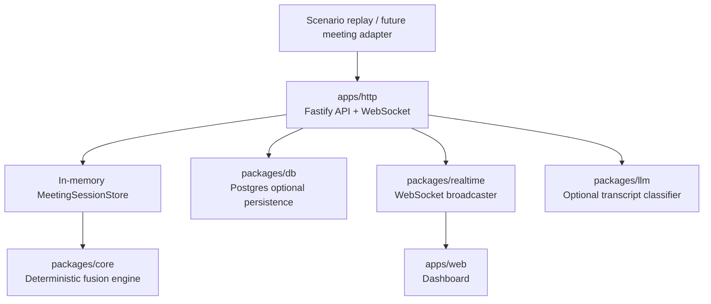
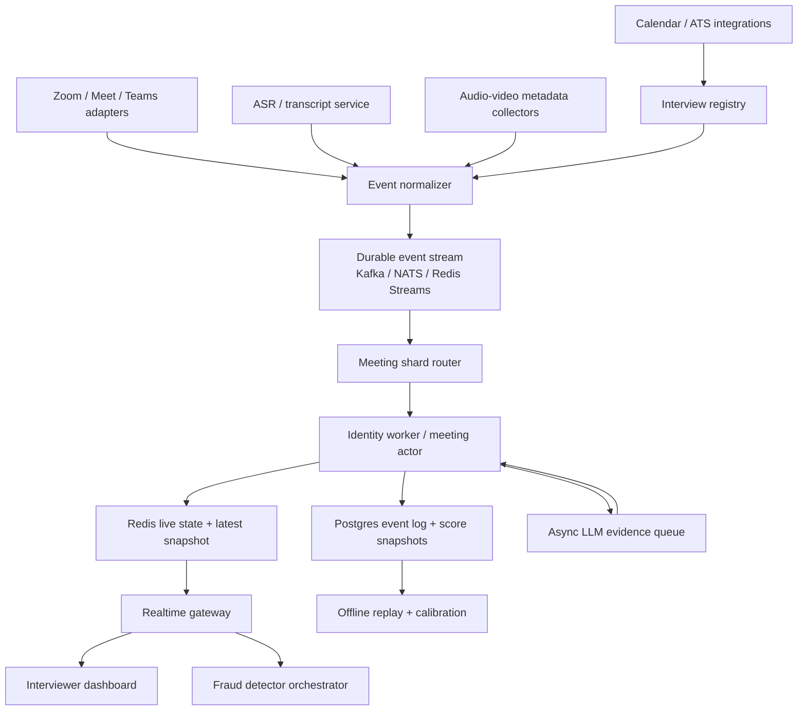

# Scalability and Production Readiness

This document explains how the current Sherlock Candidate Identity Fusion Engine should evolve from a challenge prototype into a production-grade real-time identity routing service.

The current implementation is intentionally focused on deterministic candidate identity detection. It is not the full Sherlock fraud stack. In a production Sherlock system, the pipeline should look like this:

```text
Identity detection
    ↓
Candidate verification
    ↓
Fraud detection
    ↓
Real-time interviewer commentary / alerting / audit trail
```

The identity engine answers:

> Which participant stream is the candidate stream?

The verification layer answers:

> Is this stream actually controlled by the expected human candidate?

The fraud layer answers:

> Is the candidate using AI assistance, deepfake/proxy behavior, suspicious devices, cloned voice, or other adversarial tactics?

This separation matters. Fraud detectors should not analyze every stream equally. They should analyze the participant stream that identity routing selects with enough confidence.

---

## 1. Current architecture summary

The current repository is a strong real-time prototype:



### Current strengths

- Deterministic core identity engine.
- Real-time event ingestion.
- WebSocket candidate-state updates.
- Scenario replay evaluation.
- Evidence and uncertainty explanations.
- Optional LLM as evidence source only.
- Postgres persistence for meetings, events, and score snapshots.

### Current prototype limitations

- Active sessions are stored in an in-memory `Map`.
- One backend instance owns the session state.
- No real Zoom/Meet/Teams adapter yet.
- No distributed event stream yet.
- No idempotency layer for platform events yet.
- No Redis/NATS/Kafka pub-sub layer yet.
- No incremental scoring cache yet.
- Evaluation data is synthetic, not production-labeled.

---

## 2. Why the final identity decision should stay deterministic

The identity routing layer should not depend on an LLM as the final judge.

### 2.1 LLM-as-final-judge risks

| Risk | Why it is dangerous for identity routing |
|---|---|
| Non-determinism | Same meeting can produce slightly different decisions across model calls. |
| Latency | Candidate stream routing must update quickly during live interviews. |
| Cost | Every transcript event can become expensive if routed through an LLM. |
| Hallucination | The model may infer identity beyond evidence. |
| Poor auditability | Harder to explain exact scoring behavior after an incident. |
| Provider failure | Identity routing should continue even if the LLM provider is down. |
| Compliance | Identity and fraud decisions need strict audit trails and reproducibility. |

### 2.2 Correct role for LLMs

LLMs are useful as evidence extractors, not final decision-makers.

Correct production role:

```text
Transcript chunk
    ↓
LLM classifies role evidence
    ↓
Structured JSON evidence
    ↓
Deterministic fusion engine
    ↓
Auditable candidate state
```

The LLM can say:

- this sounds candidate-like,
- this sounds interviewer-like,
- this sounds observer/admin-like,
- this is uncertain,
- here are the supporting phrases.

The deterministic engine decides how much weight that evidence deserves.

---

## 3. Production high-level design

Recommended production architecture:



### Key idea

Each meeting should behave like a small stateful stream-processing actor:

```text
meetingId → ordered event stream → one identity state machine → latest candidate snapshot
```

This keeps event ordering, scoring, and explanation consistent.

---

## 4. Production low-level design

### 4.1 Event normalization

Meeting platforms emit different payloads. Production should normalize them into Sherlock's shared event schema.

```text
Zoom participant event
Google Meet bot event
Teams roster event
ASR transcript callback
Audio activity event
Calendar update
        ↓
Event normalizer
        ↓
Sherlock MeetingEvent
```

Every normalized event should include:

```ts
{
  meetingId: string;
  participantId: string;
  type: MeetingEventType;
  timestampSec: number;
  source: string;
  sourceEventId: string;
  payload: object;
  receivedAt: string;
  idempotencyKey: string;
}
```

### 4.2 Durable event stream

Use Kafka, NATS JetStream, or Redis Streams to buffer events before identity workers process them.

Why:

- preserves ordered replay,
- handles traffic bursts,
- supports retries,
- separates meeting adapters from scoring workers,
- allows offline evaluation from the same source of truth.

Partitioning key:

```text
partitionKey = meetingId
```

All events for one meeting should go to the same partition or actor so identity state is updated in order.

### 4.3 Redis live state

Redis should hold live, low-latency state:

```text
identity:meeting:{meetingId}:state
identity:meeting:{meetingId}:snapshot
identity:meeting:{meetingId}:participants
identity:meeting:{meetingId}:locks
identity:meeting:{meetingId}:dedupe
```

Recommended structures:

| Redis key | Structure | Purpose |
|---|---|---|
| `identity:meeting:{id}:snapshot` | JSON string | Latest `CandidateStateSnapshot`. |
| `identity:meeting:{id}:participant:{participantId}` | Hash / JSON | Rolling participant state. |
| `identity:meeting:{id}:signals:{participantId}` | Sorted set / JSON | Active signal cache with expiry. |
| `identity:meeting:{id}:dedupe` | Set | Recently seen idempotency keys. |
| `identity:meeting:{id}:lock` | Lock key | Prevent two workers from mutating same meeting state. |
| `identity:updates:{meetingId}` | Pub/Sub channel | Realtime candidate-state updates. |

Redis is not the long-term audit store. Postgres or object storage should keep durable records.

### 4.4 Postgres durable store

Postgres should remain the system of record for:

- meeting metadata,
- participants,
- normalized events,
- score snapshots,
- decision traces,
- threshold/config versions,
- reviewer overrides,
- scenario/evaluation results.

Additional production fields to add:

| Table | Field / index | Purpose |
|---|---|---|
| `MeetingEvent` | `sourceEventId` unique per source | Idempotency. |
| `MeetingEvent` | `receivedAt` | Debug event delays. |
| `MeetingEvent` | `ingestionVersion` | Support schema migration. |
| `ScoreSnapshot` | `configVersion` | Know which thresholds produced a decision. |
| `ScoreSnapshot` | `engineVersion` | Replay correctness after engine changes. |
| `Participant` | `platformUserId` | Link rejoin streams. |
| `Participant` | `participantClusterId` | Group multiple stream IDs for same human. |
| `Meeting` | `tenantId` | Multi-tenant isolation. |

### 4.5 Pub/Sub and realtime gateway

The identity worker should publish compact updates:

```json
{
  "type": "candidate_state_updated",
  "meetingId": "meeting_123",
  "selectedCandidateId": "p_candidate",
  "state": "LIKELY_CANDIDATE",
  "confidence": 0.82,
  "snapshotVersion": 17
}
```

The realtime gateway can fetch the full snapshot from Redis if needed.

Recommended flow:

```text
Identity worker
    ↓ publish compact event
Redis Pub/Sub / NATS subject
    ↓
Realtime gateway
    ↓
Dashboard + fraud detector orchestrator
```

This avoids broadcasting huge snapshots to every subscriber on every event.

---

## 5. Scaling challenge: many people in the room

### Problem

The prototype recomputes signals from session state. That is acceptable for normal interviews but inefficient for large rooms with many observers.

Large room example:

```text
1 candidate
4 interviewers
12 panel observers
20 silent trainees
5 recruiting coordinators
2 participants with generic names
1 candidate rejoin
```

Issues:

- many participants produce weak/noisy evidence,
- repeated event scans become expensive,
- ambiguity can increase,
- observers may look candidate-like if they speak once,
- dashboard updates can become noisy.

### Production implementation

Use incremental per-participant scoring.

Current style:

```text
new event → scan participants/events → extract all signals → score all participants
```

Production style:

```text
new event
    ↓
identify affected participant(s)
    ↓
update that participant's rolling signal cache
    ↓
recompute only affected participant score
    ↓
update top-k ranking heap
    ↓
apply decision gates
    ↓
publish snapshot only if meaningful
```

Data structures:

```ts
type LiveParticipantIdentityState = {
  participantId: string;
  displayName: string;
  email?: string;
  activeSignals: Signal[];
  positiveWeight: number;
  negativeWeight: number;
  rawScore: number;
  confidence: number;
  lastUpdatedSec: number;
};
```

Maintain:

- a map from `participantId → score state`,
- a top-k heap ordered by confidence,
- expiring signal cache,
- current top and second candidate.

---

## 6. Scaling challenge: session state across many backend instances

### Problem

The current `MeetingSessionStore` is in memory. If there are multiple backend instances, one instance may not have the meeting state created by another instance.

Failure example:

```text
POST /meetings goes to instance A
POST /events goes to instance B
instance B does not know meetingId
→ event fails or state diverges
```

### Production implementation

Use one of these patterns:

#### Option A — Sticky routing

Route all events for a meeting to the same backend instance.

Pros:

- simple,
- fast,
- fewer distributed locking issues.

Cons:

- failover is harder,
- one hot meeting can overload one instance,
- restart requires state recovery.

#### Option B — Meeting actor workers

Use a queue/stream partitioned by `meetingId`. One worker owns a meeting at a time.

Pros:

- strong ordering,
- easy replay,
- scalable by partition count,
- clean mental model.

Cons:

- more infrastructure,
- requires worker assignment and recovery.

Recommended: **meeting actor workers**.

```text
Event stream partitioned by meetingId
    ↓
Worker consumes ordered events
    ↓
Worker updates Redis live state
    ↓
Worker persists event/snapshot to Postgres
    ↓
Worker publishes candidate_state_updated
```

---

## 7. Scaling challenge: out-of-order and duplicate events

### Problem

Meeting platforms and ASR systems can deliver events late, duplicated, or out of order.

Examples:

- transcript arrives 5 seconds after speech activity,
- display-name change arrives after transcript,
- participant rejoin event arrives before leave event,
- webhook retries deliver the same event twice,
- ASR sends partial transcript then final transcript.

### Production implementation

#### Idempotency

Each event should have:

```text
source + sourceEventId + meetingId
```

Store this in Redis dedupe set and Postgres unique index.

```text
if idempotencyKey already seen:
    ignore duplicate
else:
    process event
```

#### Ordering

Use event-time and processing-time separately:

```ts
{
  timestampSec: number;  // when event happened in meeting
  receivedAt: string;    // when Sherlock received it
}
```

For live decisions:

- process most events immediately,
- tolerate small out-of-order windows,
- re-score when late events arrive,
- emit a new snapshot version if the decision changes.

For audit/offline replay:

- sort by event-time,
- rebuild exact state,
- compare against live state if needed.

#### Partial vs final transcript

Use `isFinal` on transcript chunks:

- partial transcript can create weak temporary evidence,
- final transcript can replace or strengthen evidence,
- old partial evidence should expire or be superseded.

---

## 8. Scaling challenge: participant rejoin with new ID

### Problem

In production, a candidate may leave and rejoin with a new participant ID:

```text
p_123: Ritika Gupta leaves at 420s
p_789: MacBook Pro joins at 445s
```

The same human may now be represented by two streams.

### Production implementation

Introduce participant clustering:

```ts
type ParticipantCluster = {
  clusterId: string;
  participantIds: string[];
  confidence: number;
  reasons: string[];
};
```

Cluster signals:

| Signal | Meaning |
|---|---|
| Same email/platform user ID | Strong link. |
| Same display name after normalization | Medium/strong link. |
| Leaves and rejoins within short window | Medium link. |
| Same device metadata if available | Medium link. |
| Same voice embedding if allowed | Strong but privacy-sensitive link. |
| Same face embedding if allowed | Strong but privacy-sensitive link. |
| Same calendar invite identity | Strong link. |

Production scoring should support:

```text
participant score
cluster score
candidate stream decision
```

If a cluster is selected, the live active stream inside that cluster should be routed to fraud detectors.

---

## 9. Scaling challenge: too many observers and silent participants

### Problem

Observers may join silently, use generic names, or occasionally speak. Weak behavior signals may create noise.

Examples:

```text
Observer: "Can everyone hear me?"
Recruiter: "I'll drop off now."
Coordinator: screen shares logistics.
Silent observer uses webcam.
```

### Production implementation

Add observer/admin role modeling.

New possible signals:

| Signal | Direction | Reason |
|---|---|---|
| `calendar_optional_attendee` | negative/neutral | Optional attendees are less likely to be candidate. |
| `observer_admin_language` | negative | Logistics/admin language is not candidate-like. |
| `very_short_speech_only` | neutral | One short utterance should not imply candidate. |
| `no_candidate_specific_evidence` | neutral | Participant has activity but no identity anchor. |
| `recruiter_domain_email` | negative | Recruiter/company domain likely not candidate. |

Safety rule:

```text
Weak behavior alone should never select or confirm a candidate.
```

The current engine already follows this principle; production should keep it.

---

## 10. Scaling challenge: adversarial self-identification

### Problem

A wrong participant can say:

```text
"My name is Ritika Gupta. I am the candidate."
```

This may happen accidentally, during a test, or adversarially.

### Current protection

The engine already adds contradiction penalties when candidate-like transcript appears on interviewer-like metadata.

### Production implementation

Add stronger anti-spoofing gates:

| Gate | Behavior |
|---|---|
| Self-identification cannot confirm alone | Requires metadata or another independent signal. |
| Interviewer/company metadata override | Strong interviewer evidence blocks confirmation. |
| Candidate invite match | Candidate email/calendar invite should support high confidence. |
| Voice/face/liveness optional evidence | If Sherlock is allowed to use them, they should become independent verification signals. |
| Human override | Reviewer can mark selected stream incorrect, creating feedback data. |

Decision policy:

```text
Self-identification can make a participant likely.
Self-identification alone should not make a participant confirmed.
```

---

## 11. Scaling challenge: LLM latency, cost, and reliability

### Problem

If every transcript chunk synchronously calls an LLM, live identity routing becomes slow and expensive.

Failure modes:

- LLM provider timeout,
- rate limit,
- malformed JSON,
- high latency,
- model drift,
- high token cost,
- hallucinated evidence.

### Production implementation

Use asynchronous LLM evidence.

```text
transcript_chunk event
    ↓
run deterministic transcript rules immediately
    ↓
publish transcript chunk to LLM evidence queue if needed
    ↓
LLM worker classifies chunk
    ↓
append llm_transcript_evidence event
    ↓
identity worker updates score
```

Only call the LLM when useful:

- transcript chunk is long enough,
- deterministic rules are uncertain,
- current candidate state is ambiguous,
- confidence is near a threshold,
- transcript contains role-relevant language.

Do not call LLM for:

- silence,
- tiny filler utterances,
- already clear interviewer prompts,
- repeated transcript chunks,
- duplicate partials.

Add:

- transcript hash cache,
- timeout budget,
- schema validation,
- fallback to deterministic rules,
- model version logging,
- sampled audit.

---

## 12. Scaling challenge: WebSocket fan-out

### Problem

A production meeting may have multiple subscribers:

- interviewer dashboard,
- admin dashboard,
- fraud detector orchestrator,
- recording/audit service,
- internal monitoring.

Broadcasting full snapshots too often can create load.

### Production implementation

Use compact pub-sub updates and snapshot pull.

```text
identity worker publishes compact update
    ↓
realtime gateway receives update
    ↓
gateway pushes compact update to clients
    ↓
clients fetch full snapshot only when needed
```

Use rules:

- publish on state change,
- publish on selected participant change,
- publish if confidence changes beyond threshold,
- publish if evidence/uncertainty changes meaningfully,
- throttle cosmetic updates,
- use snapshot versioning.

Example compact event:

```json
{
  "type": "candidate_state_updated",
  "meetingId": "meeting_123",
  "snapshotVersion": 42,
  "state": "LIKELY_CANDIDATE",
  "selectedCandidateId": "p_7",
  "confidence": 0.83
}
```

---

## 13. Scaling challenge: real-time fraud detector routing

### Problem

Downstream detectors need to know which stream to analyze. But identity state may change during the meeting.

Example:

```text
0s:   no candidate selected
30s:  MacBook Pro likely candidate
90s:  second participant self-identifies
92s:  state becomes AMBIGUOUS
130s: first participant changes name + email matches
140s: first participant confirmed
```

Fraud detectors must handle transitions safely.

### Production implementation

Treat identity state as a routing contract:

| Identity state | Fraud detector behavior |
|---|---|
| `INSUFFICIENT_DATA` | Do not run candidate-only fraud verdict. Collect passive data only. |
| `AMBIGUOUS` | Do not make candidate-specific fraud claim. Flag routing ambiguity. |
| `POSSIBLE_CANDIDATE` | Optional low-risk monitoring only. No hard alert. |
| `LIKELY_CANDIDATE` | Run detectors but label evidence as likely-routed. |
| `CONFIRMED_CANDIDATE` | Run full candidate-specific fraud analysis. |

Fraud events should include identity snapshot version:

```json
{
  "fraudSignal": "ai_copilot_detected",
  "participantId": "p_7",
  "identitySnapshotVersion": 42,
  "identityStateAtDetection": "LIKELY_CANDIDATE"
}
```

This keeps the audit trail clear.

---

## 14. Production edge cases and fixes

| Edge case | What it looks like | Risk | Required implementation |
|---|---|---|---|
| Candidate joins as generic device | `MacBook Pro`, no email | Weak evidence can misroute | Keep generic names neutral; require transcript/metadata. |
| Candidate changes display name | `MacBook Pro` → `Ritika Gupta` | State must improve live | Handle display-name events as persistent evidence. |
| Candidate rejoins with new ID | `p1` leaves, `p2` joins | Evidence split across streams | Participant clustering and rejoin linking. |
| Multiple interviewers | Several company-domain participants | Interviewer selected by mistake | Strong interviewer exclusion and company-domain penalties. |
| Silent observer | Observer has webcam but no speech | Behavior noise | Weak behavior cannot select candidate alone. |
| Two similar unknowns | Both say candidate-like phrases | Wrong forced choice | Ambiguity margin and no selected candidate. |
| Interviewer tests candidate phrase | Interviewer says "I am the candidate" | Transcript spoof | Contradiction with interviewer metadata. |
| Wrong calendar candidate name | Metadata inaccurate | Name match misleading | Fuse transcript, email, invite, and behavior. |
| Missing candidate email | No strong email anchor | Lower confidence | Require more transcript/behavior/time stability. |
| ASR speaker attribution wrong | Transcript assigned to wrong participant | Wrong evidence | Use speaker confidence and decay; treat low speaker confidence as weak. |
| Duplicate webhook event | Same transcript twice | Inflated score | Idempotency keys and dedupe sets. |
| Late transcript | Evidence arrives after decision | State may need correction | Snapshot versioning and late-event replay. |
| LLM outage | Classifier unavailable | Delayed evidence | Deterministic fallback and async retry. |
| Very large room | Many weak participants | Performance/noise | Incremental scoring, top-k ranking, observer modeling. |
| Candidate and interviewer share domain | Internal candidate interview | Company-domain exclusion may be wrong | Compare candidate email domain before applying company-domain penalty. |
| Shared machine / conference room | Display name is room device | Generic stream may still be candidate | Require self-identification + video/audio verification signals. |
| Bot participant | Sherlock bot appears in meeting | Bot selected accidentally | Add bot/service-account exclusion signal. |
| Screen share by interviewer | Interviewer shares coding prompt | Screen share noise | Keep screen share weak and non-decisive. |

---

## 15. Implementation roadmap

### Phase 1 — Keep current deterministic core

Do not replace the core. Keep it pure and deterministic.

Add:

- more unit tests for edge cases,
- explicit signal snapshots in tests,
- config versioning,
- calibration fixtures,
- participant clustering design.

### Phase 2 — Production ingestion foundation

Add:

- meeting platform adapter interface,
- normalized event envelope,
- idempotency key,
- source event ID,
- event-time and received-time,
- duplicate detection,
- event schema version.

### Phase 3 — Redis live state

Add Redis for:

- latest candidate snapshot,
- active participant state,
- dedupe sets,
- pub-sub updates,
- distributed locks if needed.

### Phase 4 — Durable event stream

Add Kafka/NATS/Redis Streams for:

- buffering,
- retries,
- ordering by meeting,
- replay,
- backpressure handling.

### Phase 5 — Meeting identity workers

Move from request-time in-memory scoring to stateful workers:

```text
stream event → identity worker → Redis + Postgres + pub-sub
```

### Phase 6 — Incremental scoring

Add:

- active signal cache,
- signal expiry scheduler,
- top-k participant heap,
- participant-level recomputation,
- snapshot versioning.

### Phase 7 — Production evaluation

Add:

- labeled real meeting replays,
- false interviewer selection metric,
- ambiguous-state precision,
- time-to-likely metric,
- time-to-confirm metric,
- calibration plots,
- threshold tuning by meeting type.

---

## 16. Current architecture vs production architecture

| Area | Current prototype | Production target |
|---|---|---|
| Event source | Scenario replay / HTTP posts | Zoom/Meet/Teams/calendar/ASR adapters |
| Session state | In-memory `Map` | Redis live state + meeting actors |
| Event durability | Optional Postgres | Durable stream + Postgres audit log |
| Scoring | Recompute from session state | Incremental per-participant scoring |
| Realtime | WebSocket from HTTP app | Dedicated realtime gateway with pub-sub |
| LLM evidence | Optional synchronous classifier after transcript event | Async queue, caching, timeouts, fallback |
| Rejoin handling | Participant stream-level | Participant clustering across IDs |
| Evaluation | 20 synthetic fixtures | Synthetic + labeled production replays |
| Fraud integration | Identity snapshot only | Identity-routed detector orchestration |
| Scaling model | Single app instance demo | Sharded by meeting ID |

---

## 17. Production HLD

```text
[Calendar / ATS]
      ↓
[Interview Registry]
      ↓
[Meeting Platform Adapter] ← [Zoom / Meet / Teams]
      ↓
[Event Normalizer]
      ↓
[Durable Event Stream partitioned by meetingId]
      ↓
[Identity Worker / Meeting Actor]
      ↓             ↓              ↓
[Redis State]   [Postgres Audit]   [Async LLM Evidence Queue]
      ↓
[Pub/Sub Candidate Updates]
      ↓
[Realtime Gateway]
      ↓
[Dashboard + Fraud Detector Orchestrator]
```

---

## 18. Production LLD

### 18.1 Identity worker loop

```ts
while (true) {
  const event = await stream.read({ partitionKey: meetingId });

  if (await dedupe.has(event.idempotencyKey)) {
    continue;
  }

  const liveState = await redis.getMeetingState(event.meetingId);
  const updatedState = applyEventIncrementally(liveState, event);
  const affectedParticipants = getAffectedParticipants(event, updatedState);

  for (const participantId of affectedParticipants) {
    updateActiveSignals(updatedState, participantId, event);
    recomputeParticipantScore(updatedState, participantId);
  }

  expireOldSignals(updatedState, event.timestampSec);
  updateTopKRanking(updatedState);

  const snapshot = buildCandidateSnapshot(updatedState);

  await redis.setLatestSnapshot(event.meetingId, snapshot);
  await postgres.persistEventAndSnapshot(event, snapshot);
  await dedupe.add(event.idempotencyKey);

  if (shouldPublish(previousSnapshot, snapshot)) {
    await pubsub.publish(`identity:updates:${event.meetingId}`, compact(snapshot));
  }
}
```

### 18.2 Candidate snapshot contract

```ts
type CandidateStateSnapshot = {
  meetingId: string;
  selectedCandidateId: string | null;
  confidence: number;
  state:
    | "INSUFFICIENT_DATA"
    | "POSSIBLE_CANDIDATE"
    | "LIKELY_CANDIDATE"
    | "CONFIRMED_CANDIDATE"
    | "AMBIGUOUS";
  participants: ParticipantScore[];
  evidence: EvidenceItem[];
  uncertainty: string[];
  timestampSec?: number;
  decisionTrace?: CandidateDecisionTrace;
  snapshotVersion?: number;
  engineVersion?: string;
  configVersion?: string;
};
```

### 18.3 Fraud detector routing contract

```ts
type CandidateRoutingDecision = {
  meetingId: string;
  selectedCandidateId: string | null;
  identityState: CandidateDecisionState;
  confidence: number;
  snapshotVersion: number;
  detectorPolicy:
    | "DO_NOT_ROUTE"
    | "PASSIVE_MONITORING_ONLY"
    | "ROUTE_AS_LIKELY_CANDIDATE"
    | "ROUTE_AS_CONFIRMED_CANDIDATE";
};
```

Mapping:

| Identity state | Detector policy |
|---|---|
| `INSUFFICIENT_DATA` | `DO_NOT_ROUTE` |
| `AMBIGUOUS` | `DO_NOT_ROUTE` |
| `POSSIBLE_CANDIDATE` | `PASSIVE_MONITORING_ONLY` |
| `LIKELY_CANDIDATE` | `ROUTE_AS_LIKELY_CANDIDATE` |
| `CONFIRMED_CANDIDATE` | `ROUTE_AS_CONFIRMED_CANDIDATE` |

---

## 19. Monitoring and observability

Production metrics to track:

| Metric | Why it matters |
|---|---|
| Event ingestion latency | Detect platform or queue delays. |
| Event processing latency | Ensure real-time scoring. |
| Time to first likely candidate | Measure identity routing speed. |
| Time to confirmed candidate | Measure confidence stability. |
| Ambiguous-state rate | Detect unclear meetings or scoring weakness. |
| Insufficient-data rate | Detect missing integration data. |
| False interviewer selection rate | Critical safety metric. |
| Candidate state flip rate | Detect unstable routing. |
| LLM classifier latency | Protect live path. |
| LLM failure rate | Ensure fallback is working. |
| Snapshot publish rate | Control WebSocket/pub-sub load. |
| Event replay mismatch rate | Detect live vs replay inconsistency. |

Recommended traces:

```text
meetingId
participantId
sourceEventId
idempotencyKey
snapshotVersion
engineVersion
configVersion
selectedCandidateId
identityState
confidence
```

---

## 20. Security and privacy requirements

Because candidate identity and interview transcripts are sensitive, production must include:

- tenant isolation,
- encryption at rest,
- TLS in transit,
- strict API authentication,
- least-privilege service tokens,
- data retention policy,
- transcript redaction where possible,
- audit logging for reviewer access,
- config/version audit trail,
- deletion/export workflows,
- no committed secrets,
- privacy-aware biometric signal handling.

If face, voice, liveness, or device fingerprinting are added, they should be treated as separate verification/fraud signals with explicit privacy controls.

---

## 21. Final production recommendation

The current implementation should be treated as the **deterministic identity brain**.

Do not rebuild it as an LLM agent. Instead:

1. Keep `packages/core` pure and deterministic.
2. Add production event ingestion around it.
3. Add Redis live state and pub-sub.
4. Add durable event streams.
5. Add meeting actors for ordered processing.
6. Add incremental scoring for large rooms.
7. Add participant clustering for rejoin/device-switch cases.
8. Add real-world replay evaluation.
9. Route fraud detectors based on identity state and snapshot version.

The final architecture should make identity detection reliable enough that Sherlock's verification and fraud-detection systems always know which stream they are analyzing, why that stream was selected, and whether the selection was certain enough to act on.
